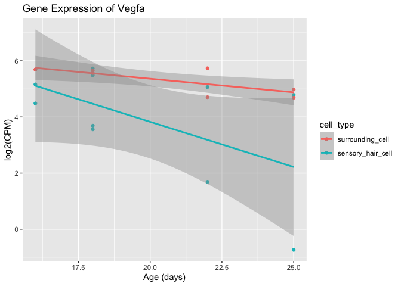
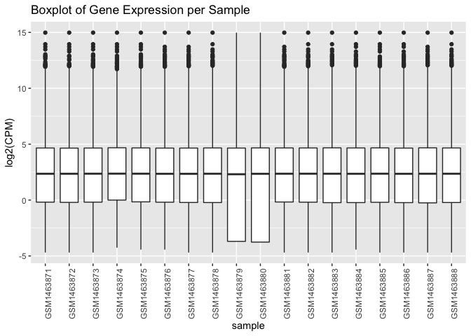
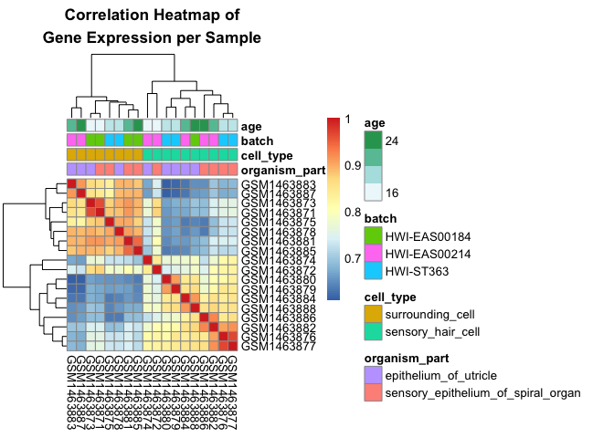

Analysis Assignment
================
Diana Lin
02/03/2020

## Table of Contents

1.  [Question 1](#question-1-data-inspection-and-basic-manipulation)
    1.  [Question
        1.1](#q11-importing-the-data-and-getting-familiar-with-it-2-points)
    2.  [Question 1.2](#q12-data-manipulation-2-points)
2.  [Question 2](#question-2-assessing-overall-data-quality)
    1.  [Question 2.1](d#q21-overall-distributions-4-points)
    2.  [Question
        2.2](#q22-how-do-the-samples-correlate-with-one-another-4-points)
3.  [Question
    3](#question-3-conducting-differential-expression-analysis)
    1.  [Question 3.1](#q31-remove-lowly-expressed-genes-3-points)
    2.  [Question 3.2](#q32-construct-linear-model-4-points)
    3.  [Question 3.3](#q33-interpret-model-2-points)
4.  [Question 4](#question-4-evaluating-the-results)
    1.  [Question
        4.1](#q41-quantifying-the-number-of-genes-differentially-expressed-3-points)
    2.  [Question 4.2](#q42-interpret-the-interaction-term-3-points)
5.  [Summary](#summary)
    1.  [Question 1](#question-1)
    2.  [Question 2](#question-2)
    3.  [Question 3](#question-3)
    4.  [Question 4](#question-4)
6.  [Bonus Question](#bonus-question-2-points)

## Question 1: Data Inspection and Basic Manipulation

### Q1.1 Importing the data and getting familiar with it (2 POINTS)

> Read the datasets into R.

``` r
metadata <-
  readRDS(here("assignment", "data", "gse60019_experiment_design.RDS"))
expr <-
  readRDS(here("assignment", "data", "gse60019_expression_matrix.RDS"))
```

The
[metadata](https://github.com/STAT540-UBC/STAT540-UBC.github.io/raw/master/homework/assignment/data/gse60019_experiment_design.RDS)
and
[expression](https://github.com/STAT540-UBC/STAT540-UBC.github.io/raw/master/homework/assignment/data/gse60019_expression_matrix.RDS)
data were downloaded and read into R using `readRDS()`.

> How many genes are there?

``` r
num_genes <- nrow(expr)
```

Each row in the expression matrix corresponds to one gene. There are
14479 genes in the dataset.

> How many samples are there?

``` r
num_samples <- nrow(metadata)
```

Each row in the metadata matrix corresponds to one sample. There are 18
samples in the dataset.

> How many factors are in our experimental design? How many levels per
> factor? List out the levels for each factor.

In the experimental design (metadata), each column is a factor except
for `sample`, which is a character, as seen
    below:

``` r
(columns <- sapply(metadata,class))
```

    ##        sample organism_part     cell_type    time_point         batch 
    ##   "character"      "factor"      "factor"      "factor"      "factor"

The number of levels of each factor are seen below:

``` r
(factors <- sapply(metadata[-1],nlevels))
```

    ## organism_part     cell_type    time_point         batch 
    ##             2             2             4             3

The levels for each factor are seen below:

``` r
(all_levels <- sapply(metadata[-1],levels))
```

    ## $organism_part
    ## [1] "epithelium_of_utricle"              "sensory_epithelium_of_spiral_organ"
    ## 
    ## $cell_type
    ## [1] "surrounding_cell"  "sensory_hair_cell"
    ## 
    ## $time_point
    ## [1] "E16" "P0"  "P4"  "P7" 
    ## 
    ## $batch
    ## [1] "HWI-EAS00184" "HWI-EAS00214" "HWI-ST363"

#### Factor Summary

Here is a summary of our
factors:

| Metadata        | Number of Levels | Levels                                                          |
| --------------- | ---------------- | --------------------------------------------------------------- |
| `organism_part` | 2                | epithelium\_of\_utricle, sensory\_epithelium\_of\_spiral\_organ |
| `cell_type`     | 2                | surrounding\_cell, sensory\_hair\_cell                          |
| `time_point`    | 4                | E16, P0, P4, P7                                                 |
| `batch`         | 3                | HWI-EAS00184, HWI-EAS00214, HWI-ST363                           |

### Q1.2 Data manipulation (2 POINTS)

> The levels of the factor `time_point` actually refer to points on a
> continous axis. In other words, it doesn’t have to be interpreted as
> strictly categorical variable. In order to make graphing easier, it
> will be helpful to convert this variable to a numeric representation.

> Create a new column in the samples metadata tibble. Call it “age” and
> populate it with the appropriate numeric values. Hint: Assume that the
> mouse gestation length is 18 days (ie. P0 = 18).

Since the mouse gestation period is 18 days, E16 becomes day 16, P0
becomes day 18, P4 becomes day 22, and P7 will become day 25.

| Developmental Stage | Age     |
| ------------------- | ------- |
| `E16`               | 16 days |
| `P0`                | 18 days |
| `P4`                | 22 days |
| `P7`                | 25 days |

A new column called `age` is created:

``` r
metadata <- metadata %>%
  mutate(
    age = case_when(
      time_point == "E16" ~ 16,
      time_point == "P0" ~ 18,
      time_point == "P4" ~ 22,
      time_point == "P7" ~ 25
    )
  ) %>%
  select(-time_point)
```

> Find the expression profile for the gene **`Vegfa`**. Make a
> scatterplot with age on the x-axis and expression value in CPM on the
> y-axis. Color the data points by cell\_type. Add in a regression line
> for each cell type.

Using `geom_smooth()`, a linear regression line can be added for each
cell type:

``` r
# pivot to longer format
expr_long <- expr %>%
  pivot_longer(cols = c(-gene), names_to = "sample") %>%
  rename(CPM = value)

expr_long_full <- expr_long %>% 
  left_join(metadata, by = "sample")

expr_long_full %>%
  filter(gene == "Vegfa") %>%
  ggplot(aes(x = age, y = CPM, color = cell_type)) +
  geom_point() +
  #  geom_point(position = position_jitter()) +
  geom_smooth(method = "lm") +
  ggtitle("Gene Expression of Vegfa") +
  xlab("Age (days)") 
```

    ## `geom_smooth()` using formula 'y ~ x'


> Is there sign of interaction between `cell_type` and `age` for
> **`Vegfa`**? Explain using what you observed in your graph from the
> previous question.

There is no interaction between `cell_type` and `age` for `Vegfa`, as
the two lines in the graph above are parallel. If there was interaction
between `cell_type` and `age`, the slopes of the lines would be
signficantly different. Although it is evident that `cell_type` has an
effect on gene expression, there is no evidence to support that there is
an interaction between `cell_type` and `age`.

This is further shown by the code below, where
`cell_typesensory_hair_cell:age` is not significant:

``` r
vegfa <- expr_long_full %>%
  filter(gene == "Vegfa")

summary(lm(CPM ~ cell_type * age, data = vegfa))
```

    ## 
    ## Call:
    ## lm(formula = CPM ~ cell_type * age, data = vegfa)
    ## 
    ## Residuals:
    ##      Min       1Q   Median       3Q      Max 
    ## -16.8654 -11.2188  -0.9906  10.9545  24.8056 
    ## 
    ## Coefficients:
    ##                                Estimate Std. Error t value Pr(>|t|)   
    ## (Intercept)                     93.6935    29.1072   3.219  0.00618 **
    ## cell_typesensory_hair_cell     -29.0436    39.9133  -0.728  0.47881   
    ## age                             -2.5431     1.4165  -1.795  0.09421 . 
    ## cell_typesensory_hair_cell:age   0.5177     1.9644   0.264  0.79599   
    ## ---
    ## Signif. codes:  0 '***' 0.001 '**' 0.01 '*' 0.05 '.' 0.1 ' ' 1
    ## 
    ## Residual standard error: 13.99 on 14 degrees of freedom
    ## Multiple R-squared:  0.472,  Adjusted R-squared:  0.3588 
    ## F-statistic: 4.172 on 3 and 14 DF,  p-value: 0.02633

The `summary(lm())` of an additive model with an interaction term shows
the same results:

``` r
summary(lm(CPM ~ cell_type + age + age:cell_type, data = vegfa))
```

    ## 
    ## Call:
    ## lm(formula = CPM ~ cell_type + age + age:cell_type, data = vegfa)
    ## 
    ## Residuals:
    ##      Min       1Q   Median       3Q      Max 
    ## -16.8654 -11.2188  -0.9906  10.9545  24.8056 
    ## 
    ## Coefficients:
    ##                                Estimate Std. Error t value Pr(>|t|)   
    ## (Intercept)                     93.6935    29.1072   3.219  0.00618 **
    ## cell_typesensory_hair_cell     -29.0436    39.9133  -0.728  0.47881   
    ## age                             -2.5431     1.4165  -1.795  0.09421 . 
    ## cell_typesensory_hair_cell:age   0.5177     1.9644   0.264  0.79599   
    ## ---
    ## Signif. codes:  0 '***' 0.001 '**' 0.01 '*' 0.05 '.' 0.1 ' ' 1
    ## 
    ## Residual standard error: 13.99 on 14 degrees of freedom
    ## Multiple R-squared:  0.472,  Adjusted R-squared:  0.3588 
    ## F-statistic: 4.172 on 3 and 14 DF,  p-value: 0.02633

## Question 2: Assessing overall data quality

### Q2.1 Overall distributions (4 POINTS)

> The expression values are currently in CPM. Log<sub>2</sub> transform
> them so that the distribution is more evenly spread out and can be
> examined more easily.

To log<sub>2</sub> transform CPM, `mutate(logCPM = log2(CPM))` is used:

``` r
# log transform all the values for limma later
expr_log <- expr %>%
  column_to_rownames(var = "gene") %>%
  map_dfc(log2) %>%
  as.data.frame() # can't add rownames on a tibble, convert to dataframe

rownames(expr_log) <- expr$gene # add row names back

# log transform and add to the dataframe
expr_long_full_log <- expr_long_full %>%
  mutate(logCPM = log2(CPM))

expr_long_full_log %>%
  filter(gene == "Vegfa") %>%
  ggplot(aes(x = age, y = logCPM, color = cell_type)) +
  geom_point() +
  geom_smooth(method = "lm") +
  ggtitle("Gene Expression of Vegfa") +
  xlab("Age (days)") +
  ylab("log2(CPM)")
```

    ## `geom_smooth()` using formula 'y ~ x'



> Examine the distribution of gene expression across all samples using:

> 1.  Box plots
> 
> <!-- end list -->
> 
>   - For the box plots, samples should be on the x-axis and expression
>     should be on the y-axis.
> 
> <!-- end list -->
> 
> 2.  Overlapping density plots
> 
> <!-- end list -->
> 
>   - For the overlapping density plots, expression should be on the
>     x-axis and density should be on the y-axis.
>   - Lines should be colored by sample (i.e. one line per sample).
>   - **Hint**: There are a number of data manipulation steps required.
>     Look at the `melt()` function in `reshape2`.

> Which two samples stand out as different, in terms of the distribution
> of expression values, compared to the rest?

According to the boxplot below, samples `GSM1463879` and `GSM1463880`
stand out in terms of distribution, compared to the others.

``` r
expr_long_full_log %>%
  ggplot(aes(x = sample, y = logCPM)) +
  geom_boxplot() +
  theme(axis.text.x = element_text(angle = 90)) +
  ylab("log2(CPM)") +
  ggtitle("Boxplot of Gene Expression per Sample")
```



By looking at the boxplot, two samples, where the minimum (bottom of the
box) is different, stand out. To find out those sample names:

``` r
(
  diff_samples <- expr_long_full_log %>%
    group_by(sample) %>%
    summarize(min = min(logCPM)) %>%
    arrange(desc(min)) %>%
    select(sample) %>%
    head(n = 2L) %>%
    pull()
)
```

    ## [1] "GSM1463879" "GSM1463880"

``` r
# format answer into a character string
suppressMessages(library(glue))
diff_samples_phrase <- glue("`{diff_samples[1]}` and `{diff_samples[2]}`")
```

According to the box plot, the two samples that are different
are`GSM1463879` and `GSM1463880`.

According to the overlapping density plot below, samples `GSM1463879`
and `GSM1463880` stand out in terms of distribution, compared to the
others. These two samples in turqouise, correspond to the large peak at
`y = 0.20`.

``` r
expr_long_full_log %>%
  ggplot(aes(x = logCPM, colour = sample)) +
  geom_density() +
  xlab("log2(CPM)") +
  ggtitle("Density Plot of Gene Expression per Sample")
```


### Q2.2 How do the samples correlate with one another? (4 POINTS)

> Examine the correlation between samples using one or more heatmaps
> (i.e. samples should be on the x axis and the y axis, and the values
> in the heatmap should be correlations). Again, use the log<sub>2</sub>
> transformed expression values. Display `cell_type`, `organism_part`,
> `age`, and `batch` for each sample in the heatmap. **Hint:** Consider
> using `pheatmap()` with annotations and cor to correlate gene
> expression between each pair of samples.

``` r
suppressMessages(library(pheatmap))

# create correlation matrix using log values
cor_expr_log <- cor(expr_log)

# metadata matrix for annotation
annotation <- metadata %>%
  column_to_rownames("sample")

pheatmap(
  cor_expr_log,
  cluster_rows = TRUE,
  cluster_cols = TRUE,
  scale = "none",
  clustering_method = "average",
  clustering_distance_cols = "euclidean",
  show_colnames = T,
  show_rownames = T,
  annotation = annotation,
  main = "Correlation Heatmap of\nGene Expression per Sample"
)
```



> Among the factors `cell_type`, `organism_part`, `age`, and `batch`,
> which one seems to be most strongly correlated with clusters in gene
> expression data? **Hint:** Consider using `cluster_rows=TRUE` in
> `pheatmap()`.

According to the heatmap above, the factor `cell_type` seems to be the
most strongly correlated with clusters in the gene expresion data. The
red boxes in the heatmap correspond to the orange boxes in `cell_type`,
corresponding to `surrounding_cell`.

> There is a sample whose expression values correlate with the samples
> of the different `cell_type` just as well as with the samples of the
> same `cell_type`. Identify this sample by its ID.

``` r
vars <- map_dbl(as.data.frame(cor_expr_log), var)

min <- min(vars)

for (i in seq_along(vars)) {
  if (min == vars[i]) {
    answer <- names(vars)[i]
    break
  }
}
```

Looking at the heatmap above, it looks like the sample is either
GSM1463872 or GSM1463874. The sample with the least difference between
samples within cell types and across cell types means there should be
very low spread among these correlation values. To determine which two
of our ‘eyeballed’ samples this is, some calculations can be done.
Calculating variance for each column of the correlation matrix and
finding the sample corresponding to the minimum determines that this
sample is GSM1463872.

## Question 3: Conducting differential expression analysis

### Q3.1 Remove lowly expressed genes (3 POINTS)

> Remove lowly expressed genes by retaining genes that have CPM \< 1 in
> at least as many samples as the smallest group size (i.e use `table()`
> to identify the number of samples belonging to each treatment group.
> The smallest group size is the smallest number in that table). Each
> treatment group consists of subjects belong to a unique combination of
> `cell_type` and `organism_part`.

> How many genes are there after filtering?

``` r
# find smallest group size for each treatment group
(minimum_num <- metadata %>%
   select(organism_part, cell_type) %>%
   table() %>%
   min())
```

    ## [1] 4

The smallest group size is 4.

To retain genes that have CPM \> 1 in at least 4 samples, the dataframe
is looped through, filtering for each gene and CPM \> 1 in each
iteration:

``` r
# use cache = TRUE to reduce knitting time
suppressMessages(library(purrr))

# get master list of all genes
all_genes <- expr$gene

kept_genes <- map_chr(all_genes, function(x)
  if ((expr_long %>%
       filter(gene == x , CPM > 1) %>%
       nrow() >= 4)) {
    x
  } else {
    NA # use NA, because if nothing, then it is NULL and causes problems
  })

# remove NA values
kept_genes <- kept_genes[!is.na(kept_genes)]

# Update each copy of the dataframe
# Original expression dataframe, logged all values, filtered genes
expr_log_filtered <- expr_log[kept_genes,]

# Long format expression, with metadata, logged CPM, and filtered genes
expr_long_full_log_filtered <- expr_log_filtered %>%
  rownames_to_column(var = "gene") %>%
  pivot_longer(cols = c(-gene), names_to = "sample") %>%
  rename(logCPM = value) %>%
  left_join(metadata, by = "sample")
  
# Original
expr_filtered <- (expr %>% column_to_rownames(var = "gene"))[kept_genes,]

(num_kept_genes <- length(kept_genes))
```

    ## [1] 12761

12761 genes out of 14479 remain after filtering.

### Q3.2 Construct linear model (4 POINTS)

> Use limma to fit a linear model with `cell_type`, `organism_part`,
> `age` and the interaction between `age` and `cell_type` as covariates
> (**Hint:** use `lmFit` and `eBayes`). Use the logCPM value instead of
> CPM to fit the linear model (Why?). Before you do this, reformat the
> data frame so that gene IDs are row names, and not a column (`limma`
> requires the dataset in this format).

First, a design matrix is constructed:

``` r
# construct design matrix
design_matrix <-
  model.matrix( ~ cell_type + organism_part + age + age:cell_type, data = metadata)
```

Next, to run `lmFit()`:

``` r
suppressMessages(library(limma))
expr_log_filtered <- as.data.frame(map_dfc(expr_filtered, log2))
rownames(expr_log_filtered) <- rownames(expr_filtered)
lm_fit <- lmFit(expr_log_filtered, design_matrix)

summary(lm_fit)
```

    ##                  Length Class  Mode     
    ## coefficients     63805  -none- numeric  
    ## rank                 1  -none- numeric  
    ## assign               5  -none- numeric  
    ## qr                   5  qr     list     
    ## df.residual      12761  -none- numeric  
    ## sigma            12761  -none- numeric  
    ## cov.coefficients    25  -none- numeric  
    ## stdev.unscaled   63805  -none- numeric  
    ## pivot                5  -none- numeric  
    ## Amean            12761  -none- numeric  
    ## method               1  -none- character
    ## design              90  -none- numeric

Next, to run `eBayes()`:

``` r
eb_fit <- eBayes(lm_fit)
summary(eb_fit)
```

    ##                  Length Class  Mode     
    ## coefficients     63805  -none- numeric  
    ## rank                 1  -none- numeric  
    ## assign               5  -none- numeric  
    ## qr                   5  qr     list     
    ## df.residual      12761  -none- numeric  
    ## sigma            12761  -none- numeric  
    ## cov.coefficients    25  -none- numeric  
    ## stdev.unscaled   63805  -none- numeric  
    ## pivot                5  -none- numeric  
    ## Amean            12761  -none- numeric  
    ## method               1  -none- character
    ## design              90  -none- numeric  
    ## df.prior             1  -none- numeric  
    ## s2.prior             1  -none- numeric  
    ## var.prior            5  -none- numeric  
    ## proportion           1  -none- numeric  
    ## s2.post          12761  -none- numeric  
    ## t                63805  -none- numeric  
    ## df.total         12761  -none- numeric  
    ## p.value          63805  -none- numeric  
    ## lods             63805  -none- numeric  
    ## F                12761  -none- numeric  
    ## F.p.value        12761  -none- numeric

### Q3.3: Interpret model (2 POINTS)

> For the gene `Eva1a`, what is the numeric value of the coeffcient of
> the age term? What does it mean?

``` r
# get coefficients.age from eb_fit
(coeff_age <- as.data.frame(eb_fit) %>%
  rownames_to_column(var = "gene") %>%
  filter(gene == "Eva1a") %>%
  select(coefficients.age))
```

    ##   coefficients.age
    ## 1       -0.2104804

``` r
# get topTable for Eva1a
(topTable_Eva <- topTable(eb_fit, coef = "age", number = Inf) %>%
  rownames_to_column(var = "gene") %>%
  filter(gene == "Eva1a"))
```

    ##    gene      logFC    AveExpr         t   P.Value adj.P.Val         B
    ## 1 Eva1a -0.2104804 -0.2122985 -1.559729 0.1386263 0.5416442 -5.014151

``` r
# check what value coefficients.age corresponds to in topTable 
for (i in seq_along(topTable_Eva)) {
  if (coeff_age == topTable_Eva[i]) {
    coeff_age_meaning <- colnames(topTable_Eva)[i]
    break
  }
}
```

The numerical value of the coefficient of age term is -0.2104804, which
represents the log<sub>2</sub> fold change in expression for `Eva1a`,
since it is the same value under logFC in `topTable(coef = "age")`. This
means that log<sub>2</sub>FC of -0.2104804 is a 0.8642494 fold change in
gene expression, since `FC
= 2**(log2FC)`.

## Question 4: Evaluating the results

### Q4.1: Quantifying the number of genes differentially expressed (3 POINTS)

> Using the linear model defined above, determine the number of genes
> differentially expressed by cell type at an FDR (use `adjust.method =
> "fdr"` in `topTable()`) less than 0.05.

``` r
de_genes <-
  topTable(
    eb_fit,
    coef = "cell_typesensory_hair_cell",
    number = Inf,
    adjust.method = "fdr",
    p.value = 0.05,
    sort.by = "logFC"
  )
num_genes_de <- nrow(de_genes)

if (num_genes_de != 0 ) {
  head(de_genes)
}
```

The number of differentially expressed genes by `cell_type` at an FDR of
0.05 is 0.

### Q4.2: Interpret the interaction term (3 POINTS)

> Explain what you are modeling with this interaction term. For a
> particular gene, what does a signifcant interaction term mean?

The interaction term of `age:cell_typesensory_hair_cell` shows whether
or not `cell_type` has an effect on gene expression at different ages
for that particular gene. Interactiont terms in general show whether two
covariates have a combined effect on gene exprssion.

If we look back at the gene `Vegfa` from
[Q1.2](#q12-data-manipulation-2-points), there was no interaction effect
using
`lm()`.

``` r
summary(lm(CPM ~ cell_type + organism_part + age + age:cell_type, data = vegfa))
```

    ## 
    ## Call:
    ## lm(formula = CPM ~ cell_type + organism_part + age + age:cell_type, 
    ##     data = vegfa)
    ## 
    ## Residuals:
    ##     Min      1Q  Median      3Q     Max 
    ## -17.992  -8.652  -3.168   7.213  21.866 
    ## 
    ## Coefficients:
    ##                                                 Estimate Std. Error t value
    ## (Intercept)                                     100.0137    26.1057   3.831
    ## cell_typesensory_hair_cell                      -29.0436    35.5701  -0.817
    ## organism_partsensory_epithelium_of_spiral_organ -12.6403     5.8760  -2.151
    ## age                                              -2.5431     1.2624  -2.015
    ## cell_typesensory_hair_cell:age                    0.5177     1.7507   0.296
    ##                                                 Pr(>|t|)   
    ## (Intercept)                                      0.00208 **
    ## cell_typesensory_hair_cell                       0.42891   
    ## organism_partsensory_epithelium_of_spiral_organ  0.05085 . 
    ## age                                              0.06512 . 
    ## cell_typesensory_hair_cell:age                   0.77214   
    ## ---
    ## Signif. codes:  0 '***' 0.001 '**' 0.01 '*' 0.05 '.' 0.1 ' ' 1
    ## 
    ## Residual standard error: 12.46 on 13 degrees of freedom
    ## Multiple R-squared:  0.6106, Adjusted R-squared:  0.4908 
    ## F-statistic: 5.096 on 4 and 13 DF,  p-value: 0.01081

The coefficient estimate for `Vegfa` for
`cell_typesensory_hair_cell:age` is 0.5176608.

Looking at all genes, the interaction effect for `age` and `cell_type`
remains
minimal.

``` r
summary(lm(CPM ~ cell_type + organism_part + age + age:cell_type, data = expr_long_full_log))
```

    ## 
    ## Call:
    ## lm(formula = CPM ~ cell_type + organism_part + age + age:cell_type, 
    ##     data = expr_long_full_log)
    ## 
    ## Residuals:
    ##    Min     1Q Median     3Q    Max 
    ##    -59    -57    -52    -32  32212 
    ## 
    ## Coefficients:
    ##                                                 Estimate Std. Error t value
    ## (Intercept)                                     54.99019    7.14408   7.697
    ## cell_typesensory_hair_cell                       0.08954    9.73409   0.009
    ## organism_partsensory_epithelium_of_spiral_organ -0.36863    1.60801  -0.229
    ## age                                              0.14397    0.34546   0.417
    ## cell_typesensory_hair_cell:age                  -0.01497    0.47909  -0.031
    ##                                                 Pr(>|t|)    
    ## (Intercept)                                     1.39e-14 ***
    ## cell_typesensory_hair_cell                         0.993    
    ## organism_partsensory_epithelium_of_spiral_organ    0.819    
    ## age                                                0.677    
    ## cell_typesensory_hair_cell:age                     0.975    
    ## ---
    ## Signif. codes:  0 '***' 0.001 '**' 0.01 '*' 0.05 '.' 0.1 ' ' 1
    ## 
    ## Residual standard error: 410.5 on 260617 degrees of freedom
    ## Multiple R-squared:  1.556e-06,  Adjusted R-squared:  -1.379e-05 
    ## F-statistic: 0.1014 on 4 and 260617 DF,  p-value: 0.982

The coefficient estimate for all genes for the interaction effect of
`age` and `cell_type` interaction is -0.0149722.

Looking at the top 10 genes in the interaction coefficient for `limma`,
the `logFC` is extremely low when compared to the differentially
expressed genes, meaning that there is no signficant interaction.

These are the top 10 differentially expressed genes for the interaction
coefficient for `cell_typesensory_hair_cell:age`:

``` r
topTable(
  eb_fit,
  coef = "cell_typesensory_hair_cell:age",
  adjust.method = "fdr",
  p.value = 0.05,
  sort.by = "logFC"
)
```

    ##            logFC    AveExpr         t      P.Value  adj.P.Val        B
    ## Gcnt4  1.0709619 -0.1126957  6.058201 1.751410e-05 0.04469949 2.821998
    ## Epha5 -0.7466946  3.0678260 -6.116711 1.570653e-05 0.04469949 2.910350
    ## Lrp8   0.6664798  3.9508720  7.784379 8.566631e-07 0.01093188 5.176694
    ## Gria3 -0.5294294  3.7949189 -6.705721 5.385059e-06 0.02290625 3.766070
    ## Cgn    0.4854159  3.2077512  6.849768 4.174838e-06 0.02290625 3.966034

These are the top 10 differentially expressed genes for the interaction
coefficient for all covariates.

``` r
topTable(
  eb_fit,
  adjust.method = "fdr",
  p.value = 0.05
)
```

    ## Removing intercept from test coefficients

    ##          cell_typesensory_hair_cell
    ## Tmem255b                 10.4340793
    ## Mgat5b                    4.4355345
    ## Mmp2                      0.3936364
    ## Lhx3                      6.2926864
    ## Tmem178b                  4.4397341
    ## Mreg                      5.9156344
    ## Axl                      -0.4543935
    ## Nrsn1                     9.0519787
    ## Grxcr1                   15.7558140
    ## Pifo                      6.6863080
    ##          organism_partsensory_epithelium_of_spiral_organ         age
    ## Tmem255b                                      -1.1808584  0.14216949
    ## Mgat5b                                         0.4791814 -0.09392361
    ## Mmp2                                          -0.1578656  0.16597285
    ## Lhx3                                          -0.2550049  0.01622296
    ## Tmem178b                                       0.2843818 -0.06094066
    ## Mreg                                           0.4868227 -0.15107234
    ## Axl                                            0.2733031  0.06580783
    ## Nrsn1                                          0.2340895  0.05325315
    ## Grxcr1                                        -0.1398492  0.36910794
    ## Pifo                                          -1.1828695  0.09947732
    ##          cell_typesensory_hair_cell.age     AveExpr        F      P.Value
    ## Tmem255b                   -0.059698589  1.37522941 260.8039 3.277652e-14
    ## Mgat5b                      0.149652056 -0.22750631 220.6566 1.198873e-13
    ## Mmp2                       -0.279232534  3.58656780 169.5684 9.166514e-13
    ## Lhx3                        0.111147669  0.20857701 140.4815 3.889895e-12
    ## Tmem178b                    0.143530007  3.79397529 130.0359 7.025434e-12
    ## Mreg                        0.042183817  8.79518217 120.9430 1.221671e-11
    ## Axl                        -0.215813102  5.19115548 113.1285 2.031484e-11
    ## Nrsn1                       0.004738521  2.08219510 112.0251 2.188637e-11
    ## Grxcr1                     -0.298680710  3.05008232 111.1860 2.317346e-11
    ## Pifo                        0.072522944  0.09701336 110.1501 2.488161e-11
    ##             adj.P.Val
    ## Tmem255b 4.182612e-10
    ## Mgat5b   7.649410e-10
    ## Mmp2     3.899130e-09
    ## Lhx3     1.240974e-08
    ## Tmem178b 1.793031e-08
    ## Mreg     2.598291e-08
    ## Axl      3.175142e-08
    ## Nrsn1    3.175142e-08
    ## Grxcr1   3.175142e-08
    ## Pifo     3.175142e-08

Compared to other covariates that have significant effects, the
interaction effect of `age` and `cell_type` is minimal, as depicted in
the two `topTable()` outputs above.

### Summary

Below is a summary of my responses to each question that only requires a
simple, (one or two word) response. Questions that require a longer
explanation are **not** summarized in the tables below, but can still be
found in their respective
sections.

#### Question 1

| Question                                                                                                          | Answer                       |
| ----------------------------------------------------------------------------------------------------------------- | ---------------------------- |
| How many genes are there?                                                                                         | 14479                        |
| How many samples are there?                                                                                       | 18                           |
| Is there sign of interaction between `cell_type` and `age` for **`Vegfa`**?                                       | No                           |
| How many factors are in our experimental design? How many levels per factor? List out the levels for each factor. | see [table](#factor-summary) |

#### Question 2

| Question                                                                                                                                                                                    | Answer                 |
| ------------------------------------------------------------------------------------------------------------------------------------------------------------------------------------------- | ---------------------- |
| Which two samples stand out as different, in terms of the distribution of expression values, compared to the rest?                                                                          | GSM1463879, GSM1463880 |
| Among the factors `cell_type`, `organism_part`, `age`, and `batch`, which one seems to be most strongly correlated with clusters in gene expression data?                                   | `cell_type`            |
| There is a sample whose expression values correlate with the samples of the different `cell_type` just as well as with the samples of the same `cell_type`. Identify this sample by its ID. | GSM1463872             |

#### Question 3

| Question                                                                           | Answer      |
| ---------------------------------------------------------------------------------- | ----------- |
| How many genes are there after filtering?                                          | 12761       |
| For the gene `Eva1a`, what is the numeric value of the coeffcient of the age term? | \-0.2104804 |

#### Question 4

| Question                                                                                                                            | Answer |
| ----------------------------------------------------------------------------------------------------------------------------------- | ------ |
| Using the linear model defined above, determine the number of genes differentially expressed by cell type at an FDR less than 0.05. | 0      |

### Bonus Question (2 POINTS)

> Compare your results to those obtained by Scheffer et al (2015).
> Discuss any discrepancies. List at least three explanations for these
> discrepancies.

In [Scheffer et al (2015)](../paper_review/paper.pdf), they found genes
that were differentially expressed in hair cells, and genes that were
differentially expressed in surrounding cells.

> Among the 20,207 annotated mouse genes, only 2008 genes were not
> expressed (\<15 total read counts). Among the remaining 18,199 genes,
> 5430 were found to be preferentially expressed in HCs (including the
> genes with no reads in the SCs) and 3230 in SCs; 9539 were expressed
> in both.

In my analysis, I found 0 differentially expressed genes by cell type.
This is the biggest and most important discrepancy, as finding
differentially expressed genes is one of the main goals of this paper.
Three reasons for this discrepancy are:

1.  While Scheffer et al. treated the time points as categorical
    variables of `E16`, `P0`, `P4`, `P7`, in my analysis, they were
    translated into a continuous variable, where the gestation period
    used was 18 days. The conversion is as follows, taking from
    [Q1.2](#q12-data-manipulation-2-points) above:
    
    > 
    > 
    > | Developmental Stage | Age     |
    > | ------------------- | ------- |
    > | `E16`               | 16 days |
    > | `P0`                | 18 days |
    > | `P4`                | 22 days |
    > | `P7`                | 25 days |
    > 

2.  Additionally, this translation is not the conventional way of
    translating developmental stages into a linear, continuous variable.
    If the gestational period was 18 days, the conventional translation
    would be as defined below, where pre-natal/embryonic stages are
    denoted as negative numbers:
    
    | Developmental Stage | Age      |
    | ------------------- | -------- |
    | `E16`               | \-2 days |
    | `P0`                | 0 days   |
    | `P4`                | 4 days   |
    | `P7`                | 7 days   |
    

    Using this translation, there is a clear, intuitive distinction
    between embryonic/pre-natal developmental age and post-natal age, as
    these stages are inherently different and should not be lumped
    together.

3.  Furthermore, the gestational period of 18 days was instructed to be
    used. In the original paper, Scheffer et al. never described the
    gestational period of the mice they used in their experiment, and
    this ‘arbitrarily’ chosen gestation period could be the culprit for
    the discrepancies as well.

Scheffer et al. did not make any effort into sharing their processed
data (i.e. after CPM normalization). The data shared were the raw
RNA-seq reads deposited in the SRA. The GEO submission did not include
any processed expression data, which makes their analysis minimally
reproducible, so discrepancies as such are expected. To maximize
reproducibility, Scheffer et al. should have provided access to both the
raw RNA-seq reads, their downstream, processed data, as well as all the
scripts used to process and statistically analyze their processed data.
