# Principal Component Analysis

Given the results with manual scaling, I have decided to do everything by the book this time, and use the scaling and recentering built into `prcomp()`.

```r
metadata <-
    readRDS(file = here("data", "processed_data", "metadata.rds"))

expr <- readRDS(file = here("data","raw_data", "data.rds")) %>%
    column_to_rownames(var = "CG")

pcs <- prcomp(na.omit(expr), center = TRUE, scale = TRUE)
```

The code above was taken directly from [`PCA_revised.R`](https://github.com/STAT540-UBC/Repo_team_The-Splice-Girls_W2020/blob/master/src/PCA_revised.R).

Using this method, the results were different for `summary(pcs)`:

```
Importance of components:
                          PC1     PC2     PC3     PC4    PC5
Standard deviation     7.2355 1.08636 0.87153 0.71411 0.6489
Proportion of Variance 0.8582 0.01935 0.01245 0.00836 0.0069
Cumulative Proportion  0.8582 0.87757 0.89002 0.89838 0.9053
                           PC6     PC7     PC8     PC9    PC10
Standard deviation     0.62943 0.62370 0.55663 0.49530 0.48852
Proportion of Variance 0.00649 0.00638 0.00508 0.00402 0.00391
Cumulative Proportion  0.91178 0.91816 0.92324 0.92726 0.93117

```

## Cancer Type
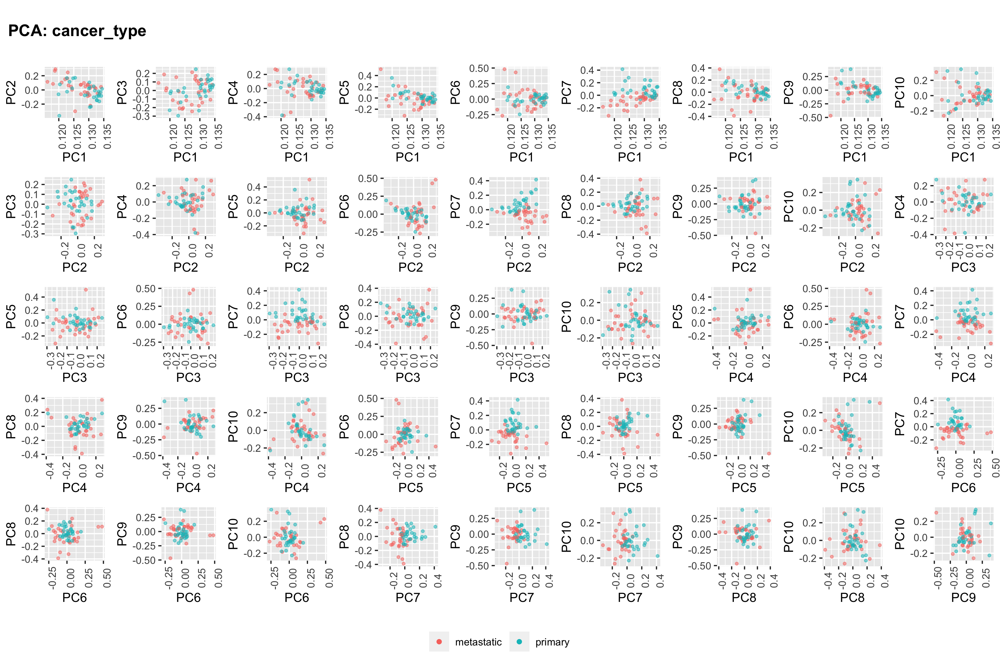

## Cancer
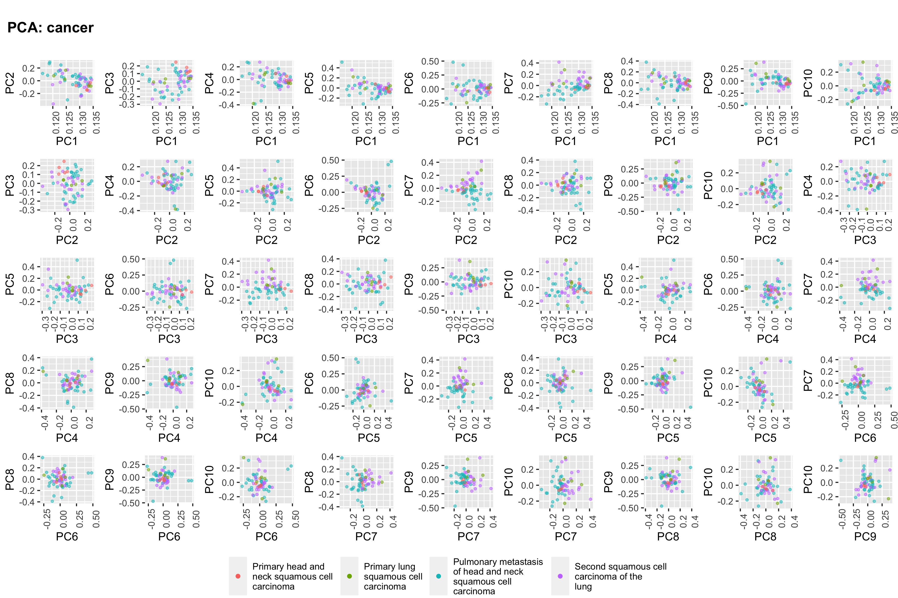

## Source
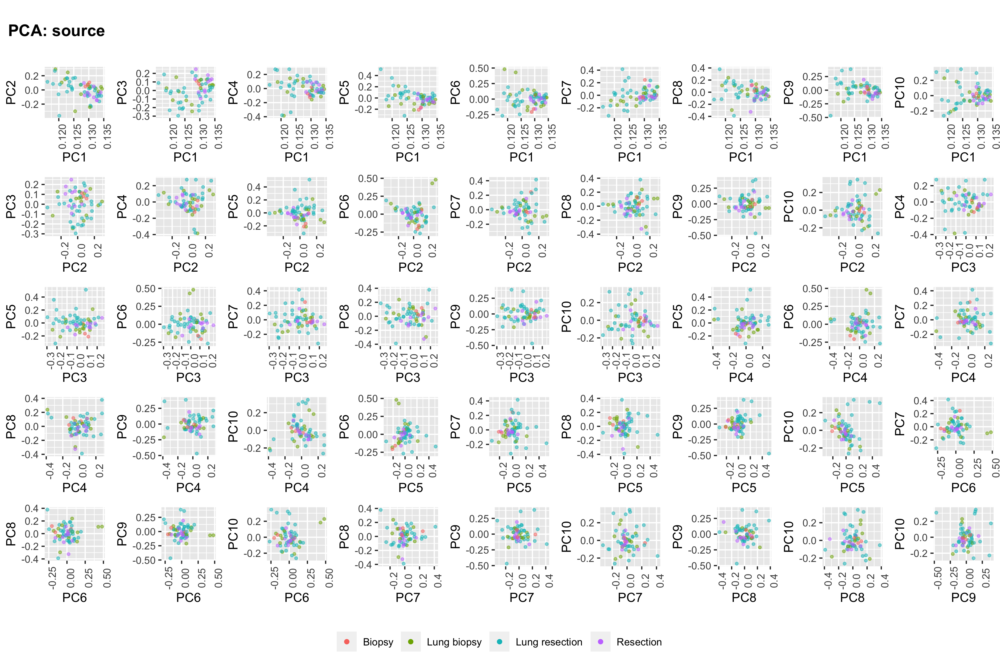

## Origin
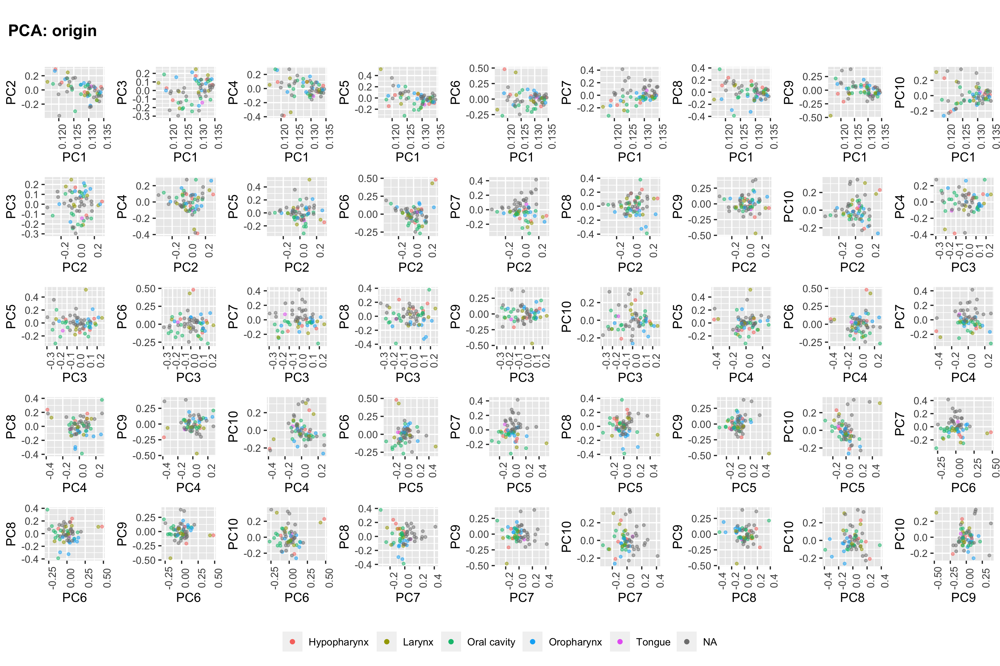

## Sex
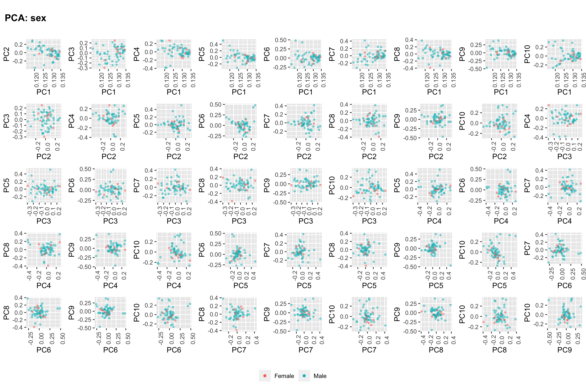

## HPV
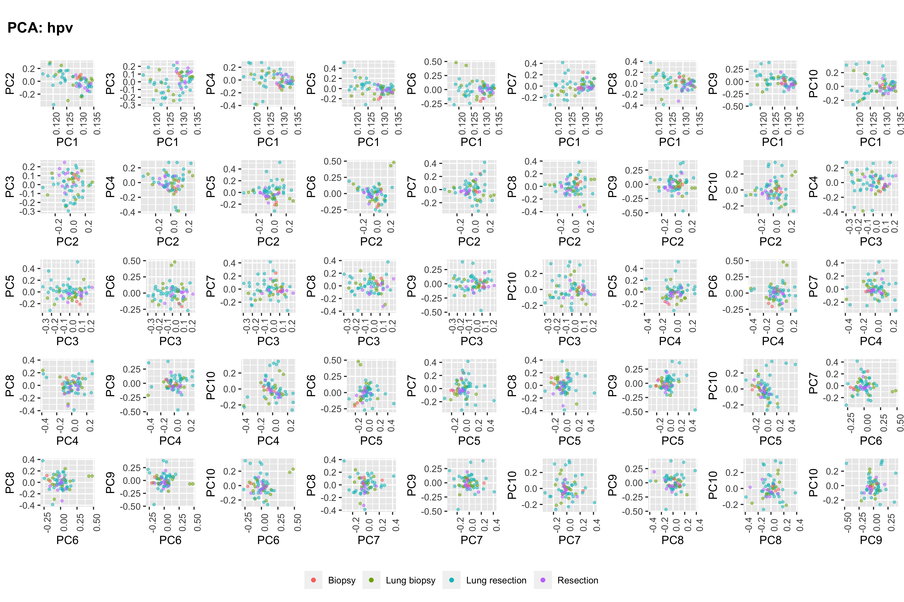

## p16
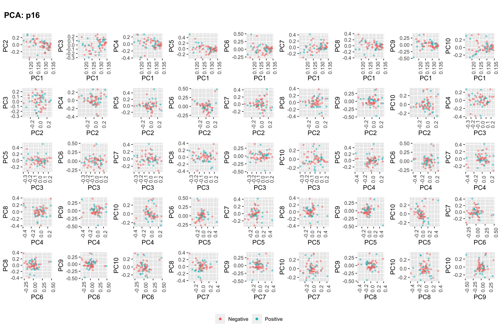

## Smoking Status
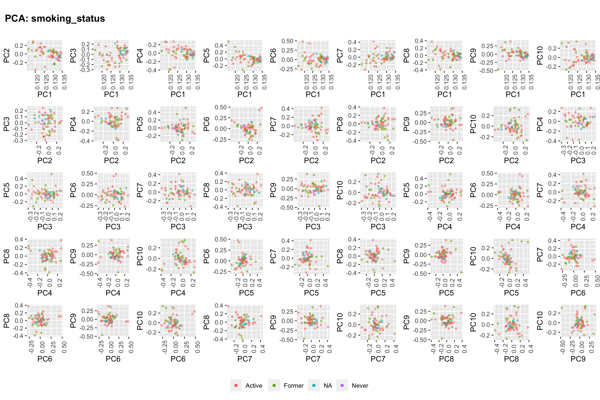

## Packs Per Year
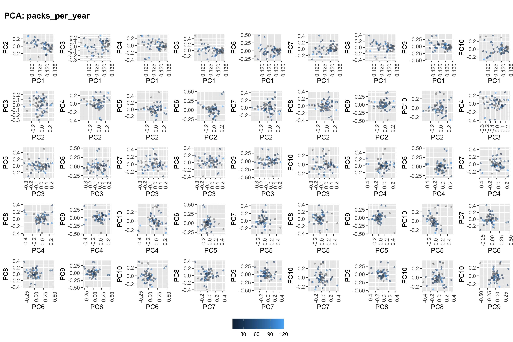

## Age
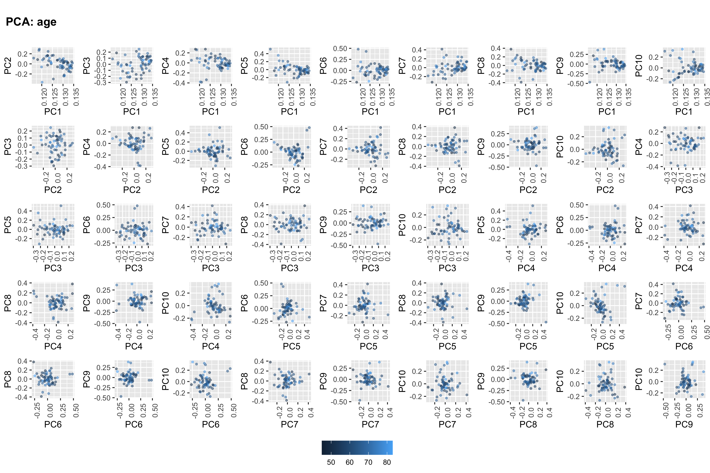

## DNA (ng)
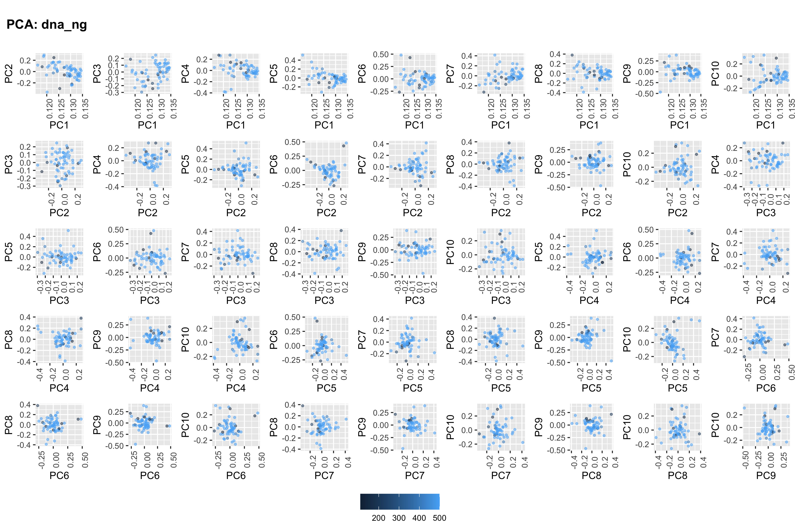

## Tumour Percent
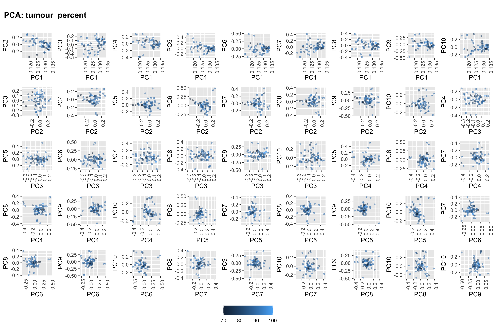
