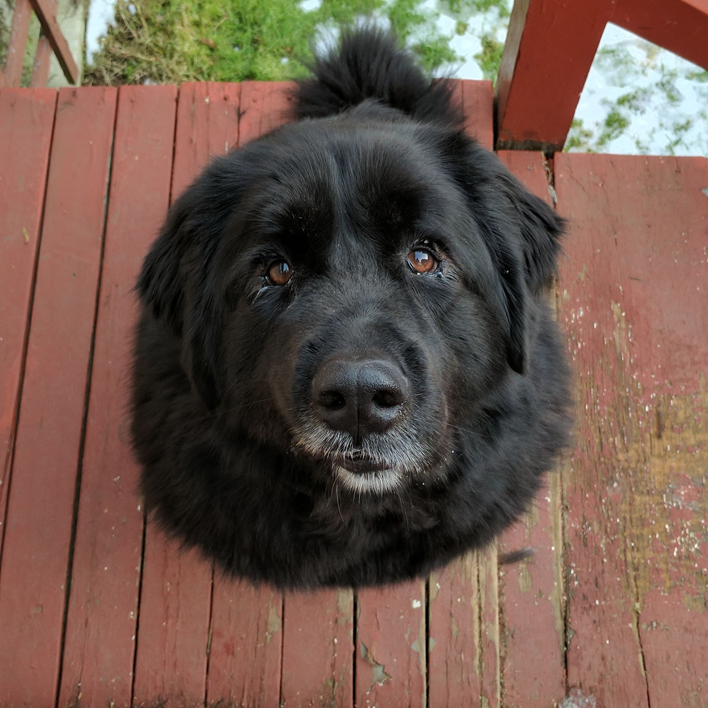
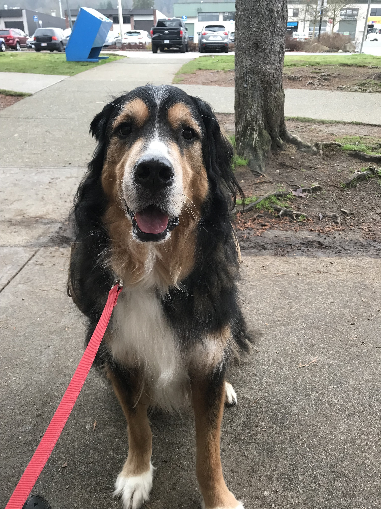
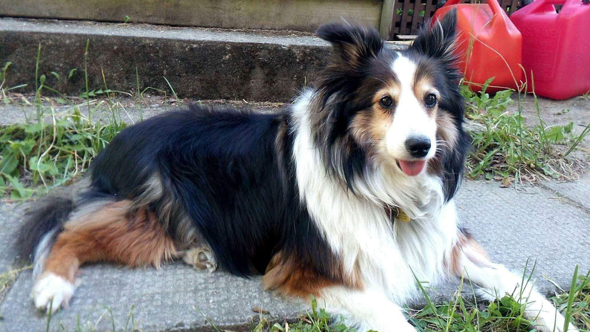
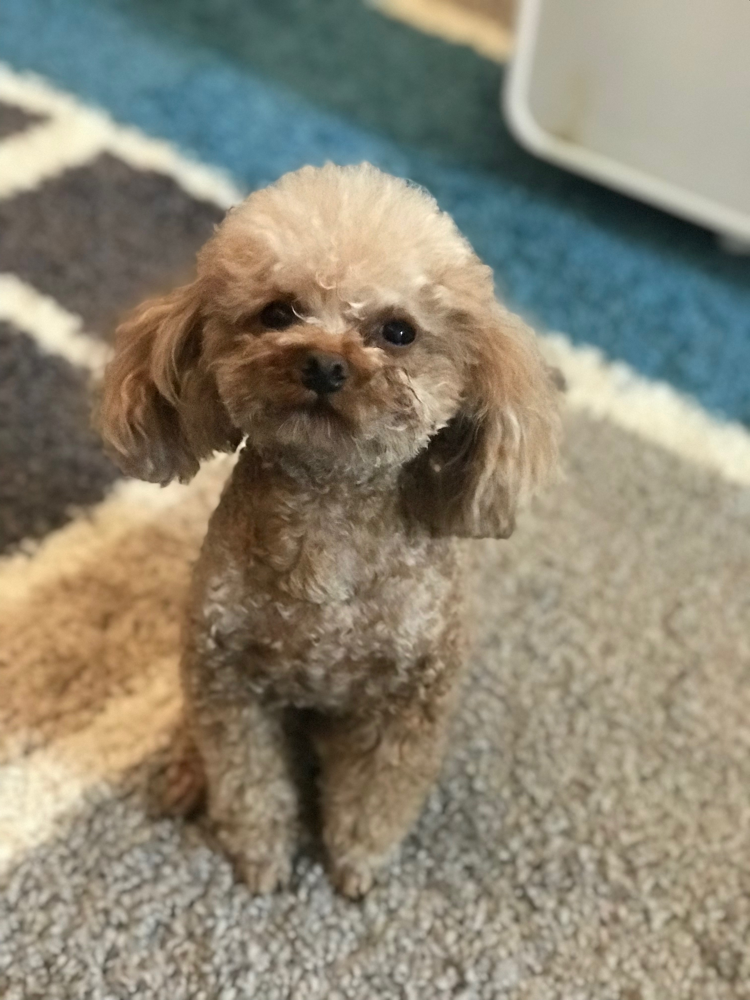
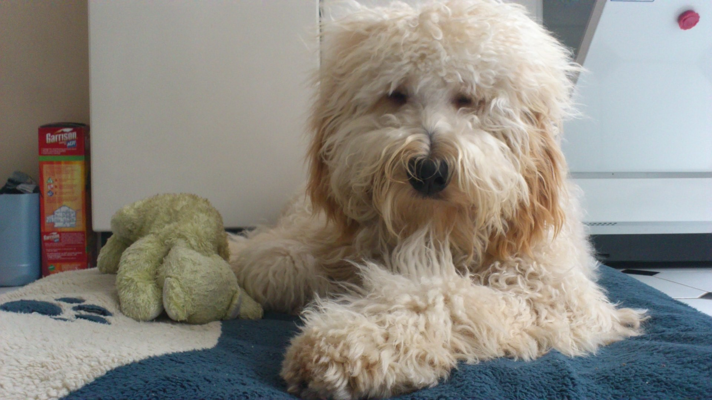
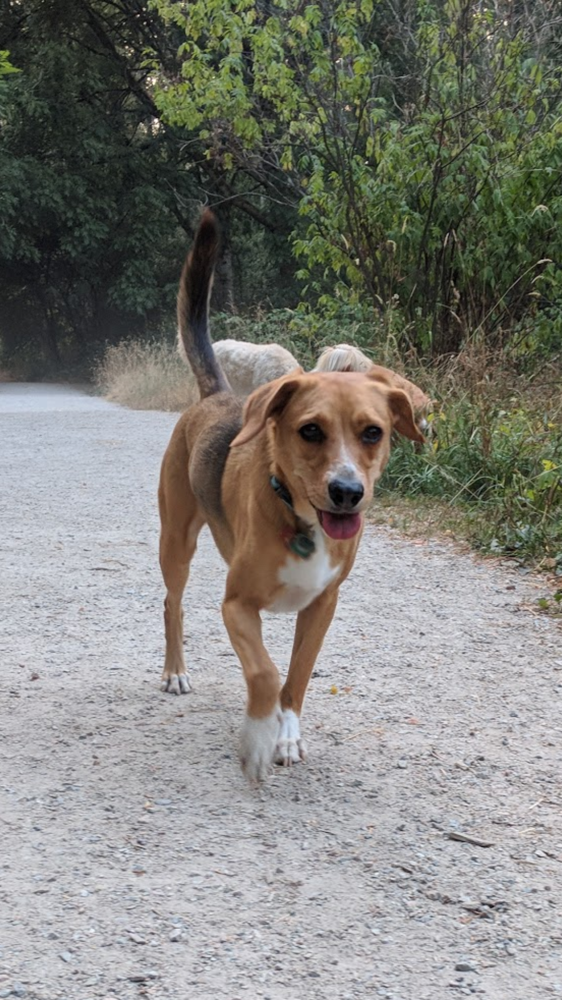
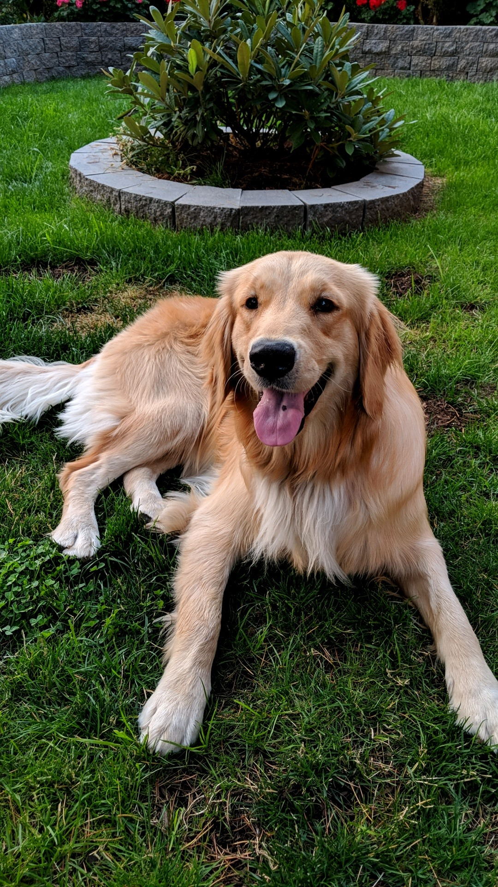
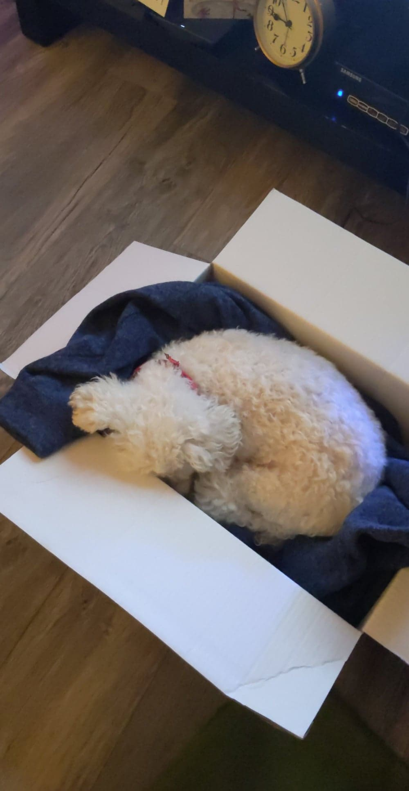
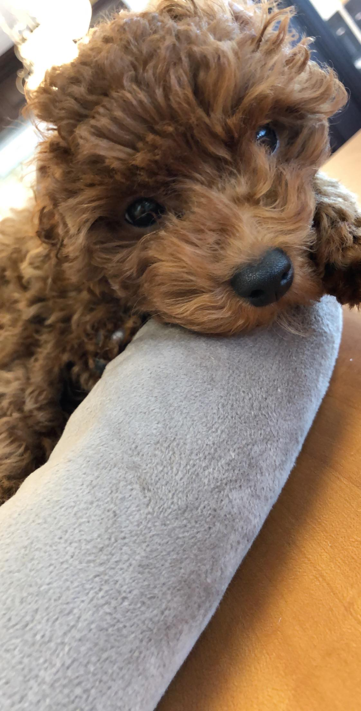

```{r setup, include=FALSE}
knitr::opts_chunk$set(echo = TRUE)
```

To demonstrate that I've understood the seminar material regarding markdown features, I've compiled a simple summary of dogs I know. Markdown features used include:

* Headers
* Lists
* Links
* Images

# Meet the Dogs

```{r load packages, message = FALSE, warning = FALSE}
library(tidyverse)
library(knitr)
library(ggrepel)
```

Read in the data:
```{r load csv}
dogs <- read_csv("dogs/dogs.csv", 
                 col_types = cols(col_character(),
                                  col_character(), 
                                  col_factor(),
                                  col_factor(),
                                  col_double()))
dogs$Size <- fct_relevel(dogs$Size, "small")

```

What's in this data frame?
```{r show data}
kable(dogs)
```

## Dumpling


```{r Dumpling}
dogs %>%
  filter(Name == "Dumpling") %>%
  kable()
```

#### Likes
* playing fetch
* swimming
* snow
* car rides with the windows down

#### Dislikes
* baths
* grooming
* rain
* puddles
* liver (but liver-flavoured treats are ok)
* hula hoops

#### Favourite Foods
1. Cheesecake
1. Any other cake
1. Beef
1. Peanut butter
1. Bananas

*Fun fact*: She loves playing with the laser pointer, like a cat!

**Instagram**: [\@dumpling_thebc](http://www.instagram.com/dumpling_thebc)

## Cupcake


```{r Cupcake}
dogs %>%
  filter(Name == "Cupcake") %>%
  kable()
```

#### Likes
* human food
* baths
* apples
* snow
* guarding the house

#### Dislikes
* rain
* water
* strangers
* toys
* the vacuum
* *cheap* dog treats

#### Favourite Foods
1. Cesar dog food
1. Bacon flavour dog treats
1. Apples
1. Chicken
1. Peanut butter
1. Mango


_Fun fact_: She loves wet dog food but it makes her poop wet, so a bit of wet food is mixed into her dry food.

## Bella


```{r Bella}
dogs %>%
  filter(Name == "Bella") %>%
  kable()
```

#### Likes
* cheese
* peanut butter
* banana
* rabbit poop
* chasing after rabbits

#### Dislikes
* celeri
* carrots

#### Favourite Foods
1. Cheese
1. Peanut butter (and banana)
1. Cucumber
1. Whatever she can get

_Fun fact_: She loves to have her butt scratched.

## Nova




```{r Nova}
dogs %>%
  filter(Name == "Nova") %>%
  kable()
```

#### Likes
* snow
* napping
* soccer balls
* eating sticks
* cleaning ears

#### Dislikes
* peanut butter (thinks there's medicine in it)
* that one specific neighbour
* baths
* apples
* strangers (nervous)

#### Favourite Foods
1. Chicken
1. Ice cream (lactose intolerant but will beg for it)
1. Yams
1. Dentastix
1. Rice
1. Oranges

*Fun fact*: Honestly very catlike-- will walk away from you if you sit too close but will be upset if not in the same room.

## Peas



```{r Peas}
dogs %>%
  filter(Name == "Peas") %>%
  kable()
```

#### Likes
* bread
* hiking
* chest rubs

#### Dislikes
* oranges
* when you touch his feet
* when you blow on his face

#### Favourite Foods
1. Bread
1. Chicken
1. Duck
1. Lamb
1. Beef
1. Eggs
1. Rice
1. Potato
1. Sweet potato
1. Pumpkin
1. Broccoli
1. Spinach
1. Lettuce

_Fun fact_: His kisses are essentially a wet nose bumping into your face.

__Instagram__: [\@peasthegreatberner](http://www.instagram.com/peasthegreatberner)

## Delilah




```{r Delilah}
dogs %>%
  filter(Name == "Delilah") %>%
  kable()
```

#### Likes
* lounging and napping
* meeting new people
* being pet
* nice ear massages

#### Dislikes
* when her family swims in any body of water (especially the swimming pool)
* her niece, 9-month-old Harley the beagle

#### Favourite Foods
1. Salmon
1. Peanut butter
1. Cod jerkey

_Fun fact_: Delilah tells off Harley for being too high strung.

## Dumbo



```{r Dumbo}
dogs %>%
  filter(Name == "Dumbo") %>%
  kable()
```

#### Likes
* attention
* cuddling

#### Dislikes
* toys
* darkness
* being left alone at night
* Maya

#### Favourite Foods
1. Wet dog food
1. Chicken breast
1. Watermelon
1. Apples
1. Bananas

_Fun fact_: He bites at night and nobody (not even the vet) knows why.

## Maya


```{r Maya}
dogs %>%
  filter(Name == "Maya", `Age (years)` == 5) %>%
  kable()
```

#### Likes
* any food
* going for walks
* napping
* being held

#### Dislikes
* walking at home
* sleeping alone
* her own bed
* toys
* Dumbo

#### Favourite Foods
1. Wet dog food
1. Any food

_Fun fact_: She will follow you wherever you go at home.

## Toby


```{r Toby}
dogs %>%
  filter(Name == "Toby") %>%
  kable()
```

#### Likes
* chest scratches
* pats
* window watching / scenery

#### Dislikes
* his pants
* going out in crappy weather
* baths

#### Favourite Foods
1. Salmon
1. Meat
1. Ice cream
1. Whimzees

_Fun fact_: he had a mop phase!

 <br/><br/>


## Sonny


```{r Sonny}
dogs %>%
  filter(Name == "Toby") %>%
  kable()
```

#### Likes
* soft blankets and pillows
* swimming

#### Dislikes
* vacuum
* fireworks
* white fluffy dogs
* the mailman

#### Favourite Foods
1. Human food
1. Salmon
1. Meat
1. Ice cream

_Fun fact_: He's a rescue from Texas!

## Cookie



```{r Cookie}
dogs %>%
  filter(Name == "Cookie") %>%
  kable()
```

#### Likes
* running
* Rachel

#### Dislikes
* people touching his paws

#### Favourite Foods
1. Meat

_Fun fact_: He's a rescue from Taiwan!

## Luna



```{r Luna}
dogs %>%
  filter(Name == "Luna") %>%
  kable()
```

#### Likes
* attention

#### Dislikes
* being leashed
* the mailman

#### Favourite Foods
1. Meat
1. Fruit
1. Ice cream

_Fun fact_: She has a surprisingly deep bark.

## Buddy


```{r Buddy}
dogs %>%
  filter(Name == "Buddy") %>%
  kable()
```

#### Likes
* TREATS

#### Dislikes
* brushing his teeth
* walking when he doesn't want to 
* rain
* the vet
* starfruit

#### Favourite Foods
1. Meat
1. Anything

_Fun fact_: He will respond to "TREATS" more than his own name.

**Instagram**: [\@buddychaoder](http://www.instagram.com/buddychaoder)

## Maya


```{r Maya-2}
dogs %>%
  filter(Name == "Maya", `Age (years)` == 13) %>%
  kable()
```

#### Likes
* walks
* grandma
* drives

#### Dislikes
* lettuce
* other dogs (scared)

#### Favourite Foods
1. Chicken
1. Oranges
1. Frozen veggies
1. Bananas
1. Apples

_Fun fact_: She got a box (accidentally) for Christmas and loves to sleep in it!



## 小點 (Dots)


```{r Dots}
dogs %>%
  filter(Name == "小點 (Dots)") %>%
  kable()
```

#### Likes
* walks
* catch (especially with balls)
* that game where you move your hand under the blanket and she goes crazy for it
* food, especially treats like milk bones
* human food

#### Dislikes
* bikes
* runners
* skateboarders
* fireworks
* crows
* cutting nails
* baths (maybe water in general)

#### Favourite Foods
1. Beef/Salmon
1. Pork/Chicken
1. Treats
1. Whatever we're eating
1. Fruits and veggies (carrots, watermelon, papaya, cantaloupe, durian)

_Fun fact_: She's the oldest in her litter of 7.

## Teddy



```{r Teddy}
dogs %>%
  filter(Name == "Teddy") %>%
  kable()
```

### Likes
* ATTENTION
* belly rubs
* to be chased / play
* pets

### Dislikes
* no attention
* being ignored/not let in the same room

### Favourite Foods
1. TREATS
1. Kibble

_Fun fact_: His back right knee is too small and his leg is slightly crooked so he limps-- it doesn't hurt for him though!

# Dog Characteristics

Here is a summary of our dog squad's characteristics:
```{r characteristics}
dogs %>%
  ggplot(aes(x=Size, y=`Age (years)`, colour = Sex)) +
  geom_jitter(position = position_jitter(width = 0.3, 
                                         seed = 6)) + 
  geom_text_repel(aes(label=Name), 
                  position = position_jitter(width = 0.3, 
                                             seed = 6), 
                  show.legend = FALSE, 
                  colour = "black",
                  family = "STFangsong",
                  size = 5) +
  labs(y = "Age (years)",
       x = "Size",
       title = "Dog Characteristics") +
  theme_bw() +
  theme(text = element_text(size = 18, 
                            family = "STFangsong"),
        legend.title.align = 0.5)
```

