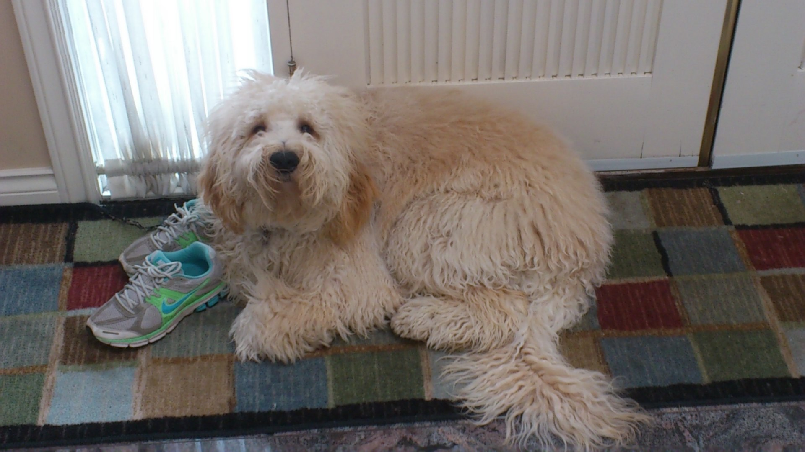

Seminar 02a: First Markdown File
================
Diana Lin
13/01/2020

To demonstrate that I’ve understood the seminar material regarding
markdown features, I’ve compiled a simple summary of dogs I know.
Markdown features used include:

  - Headers
  - Lists
  - Links
  - Images

# Meet the Dogs

``` r
library(tidyverse)
library(knitr)
library(ggrepel)
```

Read in the data:

``` r
dogs <- read_csv("dogs/dogs.csv", 
                 col_types = cols(col_character(),
                                  col_character(), 
                                  col_factor(),
                                  col_factor(),
                                  col_double()))
dogs$Size <- fct_relevel(dogs$Size, "small")
```

What’s in this data
frame?

``` r
kable(dogs)
```

| Name      | Breed                                   | Sex    | Size   | Age (years) |
| :-------- | :-------------------------------------- | :----- | :----- | ----------: |
| Dumpling  | Border Collie                           | female | medium |         2.0 |
| Cupcake   | Bichon/Shih Tzu                         | female | small  |        13.0 |
| Bella     | Goldendoodle                            | female | large  |        10.0 |
| Nova      | Tibetan Mastiff                         | female | large  |         7.0 |
| Peas      | Bernese Mountain Dog/Great Pyrenees     | male   | large  |         8.0 |
| Delilah   | Shetland Sheepdog                       | female | medium |        13.0 |
| Dumbo     | Toy Poodle                              | male   | small  |         6.0 |
| Maya      | Toy Poodle                              | female | small  |         5.0 |
| Toby      | Goldendoodle                            | male   | large  |         8.0 |
| Sonny     | Pitbull/Retriever                       | male   | large  |         6.0 |
| Cookie    | Beagle Mix                              | male   | small  |         8.0 |
| Luna      | Golden Retriever                        | female | medium |         2.0 |
| Buddy     | Pomeranian Chihuahua                    | male   | small  |        10.0 |
| Maya      | Cockerspaniel Toy Poodle Mix (Cockapoo) | female | small  |        13.0 |
| 小點 (Dots) | English Jack Russel Terrier             | female | small  |         8.0 |
| Teddy     | Toy Poodle                              | male   | small  |         0.6 |

## Dumpling


``` r
dogs %>%
  filter(Name == "Dumpling") %>%
  kable()
```

| Name     | Breed         | Sex    | Size   | Age (years) |
| :------- | :------------ | :----- | :----- | ----------: |
| Dumpling | Border Collie | female | medium |           2 |

#### Likes

  - playing fetch
  - swimming
  - snow
  - car rides with the windows down

#### Dislikes

  - baths
  - grooming
  - rain
  - puddles
  - liver (but liver-flavoured treats are ok)
  - hula hoops

#### Favourite Foods

1.  Cheesecake
2.  Any other cake
3.  Beef
4.  Peanut butter
5.  Bananas

*Fun fact*: She loves playing with the laser pointer, like a cat\!

**Instagram**:
[@dumpling\_thebc](http://www.instagram.com/dumpling_thebc)

## Cupcake

 

``` r
dogs %>%
  filter(Name == "Cupcake") %>%
  kable()
```

| Name    | Breed           | Sex    | Size  | Age (years) |
| :------ | :-------------- | :----- | :---- | ----------: |
| Cupcake | Bichon/Shih Tzu | female | small |          13 |

#### Likes

  - human food
  - baths
  - apples
  - snow
  - guarding the house

#### Dislikes

  - rain
  - water
  - strangers
  - toys
  - the vacuum
  - *cheap* dog treats

#### Favourite Foods

1.  Cesar dog food
2.  Bacon flavour dog treats
3.  Apples
4.  Chicken
5.  Peanut butter
6.  Mango

*Fun fact*: She loves wet dog food but it makes her poop wet, so a bit
of wet food is mixed into her dry food.

## Bella


``` r
dogs %>%
  filter(Name == "Bella") %>%
  kable()
```

| Name  | Breed        | Sex    | Size  | Age (years) |
| :---- | :----------- | :----- | :---- | ----------: |
| Bella | Goldendoodle | female | large |          10 |

#### Likes

  - cheese
  - peanut butter
  - banana
  - rabbit poop
  - chasing after rabbits

#### Dislikes

  - celeri
  - carrots

#### Favourite Foods

1.  Cheese
2.  Peanut butter (and banana)
3.  Cucumber
4.  Whatever she can get

*Fun fact*: She loves to have her butt scratched.

## Nova

 

``` r
dogs %>%
  filter(Name == "Nova") %>%
  kable()
```

| Name | Breed           | Sex    | Size  | Age (years) |
| :--- | :-------------- | :----- | :---- | ----------: |
| Nova | Tibetan Mastiff | female | large |           7 |

#### Likes

  - snow
  - napping
  - soccer balls
  - eating sticks
  - cleaning ears

#### Dislikes

  - peanut butter (thinks there’s medicine in it)
  - that one specific neighbour
  - baths
  - apples
  - strangers (nervous)

#### Favourite Foods

1.  Chicken
2.  Ice cream (lactose intolerant but will beg for it)
3.  Yams
4.  Dentastix
5.  Rice
6.  Oranges

*Fun fact*: Honestly very catlike– will walk away from you if you sit
too close but will be upset if not in the same room.

## Peas


``` r
dogs %>%
  filter(Name == "Peas") %>%
  kable()
```

| Name | Breed                               | Sex  | Size  | Age (years) |
| :--- | :---------------------------------- | :--- | :---- | ----------: |
| Peas | Bernese Mountain Dog/Great Pyrenees | male | large |           8 |

#### Likes

  - bread
  - hiking
  - chest rubs

#### Dislikes

  - oranges
  - when you touch his feet
  - when you blow on his face

#### Favourite Foods

1.  Bread
2.  Chicken
3.  Duck
4.  Lamb
5.  Beef
6.  Eggs
7.  Rice
8.  Potato
9.  Sweet potato
10. Pumpkin
11. Broccoli
12. Spinach
13. Lettuce

*Fun fact*: His kisses are essentially a wet nose bumping into your
face.

**Instagram**:
[@peasthegreatberner](http://www.instagram.com/peasthegreatberner)

## Delilah

 

``` r
dogs %>%
  filter(Name == "Delilah") %>%
  kable()
```

| Name    | Breed             | Sex    | Size   | Age (years) |
| :------ | :---------------- | :----- | :----- | ----------: |
| Delilah | Shetland Sheepdog | female | medium |          13 |

#### Likes

  - lounging and napping
  - meeting new people
  - being pet
  - nice ear massages

#### Dislikes

  - when her family swims in any body of water (especially the swimming
    pool)
  - her niece, 9-month-old Harley the beagle

#### Favourite Foods

1.  Salmon
2.  Peanut butter
3.  Cod jerkey

*Fun fact*: Delilah tells off Harley for being too high strung.

## Dumbo


``` r
dogs %>%
  filter(Name == "Dumbo") %>%
  kable()
```

| Name  | Breed      | Sex  | Size  | Age (years) |
| :---- | :--------- | :--- | :---- | ----------: |
| Dumbo | Toy Poodle | male | small |           6 |

#### Likes

  - attention
  - cuddling

#### Dislikes

  - toys
  - darkness
  - being left alone at night
  - Maya

#### Favourite Foods

1.  Wet dog food
2.  Chicken breast
3.  Watermelon
4.  Apples
5.  Bananas

*Fun fact*: He bites at night and nobody (not even the vet) knows why.

## Maya


``` r
dogs %>%
  filter(Name == "Maya", `Age (years)` == 5) %>%
  kable()
```

| Name | Breed      | Sex    | Size  | Age (years) |
| :--- | :--------- | :----- | :---- | ----------: |
| Maya | Toy Poodle | female | small |           5 |

#### Likes

  - any food
  - going for walks
  - napping
  - being held

#### Dislikes

  - walking at home
  - sleeping alone
  - her own bed
  - toys
  - Dumbo

#### Favourite Foods

1.  Wet dog food
2.  Any food

*Fun fact*: She will follow you wherever you go at home.

## Toby


``` r
dogs %>%
  filter(Name == "Toby") %>%
  kable()
```

| Name | Breed        | Sex  | Size  | Age (years) |
| :--- | :----------- | :--- | :---- | ----------: |
| Toby | Goldendoodle | male | large |           8 |

#### Likes

  - chest scratches
  - pats
  - window watching / scenery

#### Dislikes

  - his pants
  - going out in crappy weather
  - baths

#### Favourite Foods

1.  Salmon
2.  Meat
3.  Ice cream
4.  Whimzees

*Fun fact*: he had a mop phase\!

 <br/><br/> 

## Sonny


``` r
dogs %>%
  filter(Name == "Toby") %>%
  kable()
```

| Name | Breed        | Sex  | Size  | Age (years) |
| :--- | :----------- | :--- | :---- | ----------: |
| Toby | Goldendoodle | male | large |           8 |

#### Likes

  - soft blankets and pillows
  - swimming

#### Dislikes

  - vacuum
  - fireworks
  - white fluffy dogs
  - the mailman

#### Favourite Foods

1.  Human food
2.  Salmon
3.  Meat
4.  Ice cream

*Fun fact*: He’s a rescue from Texas\!

## Cookie


``` r
dogs %>%
  filter(Name == "Cookie") %>%
  kable()
```

| Name   | Breed      | Sex  | Size  | Age (years) |
| :----- | :--------- | :--- | :---- | ----------: |
| Cookie | Beagle Mix | male | small |           8 |

#### Likes

  - running
  - Rachel

#### Dislikes

  - people touching his paws

#### Favourite Foods

1.  Meat

*Fun fact*: He’s a rescue from Taiwan\!

## Luna


``` r
dogs %>%
  filter(Name == "Luna") %>%
  kable()
```

| Name | Breed            | Sex    | Size   | Age (years) |
| :--- | :--------------- | :----- | :----- | ----------: |
| Luna | Golden Retriever | female | medium |           2 |

#### Likes

  - attention

#### Dislikes

  - being leashed
  - the mailman

#### Favourite Foods

1.  Meat
2.  Fruit
3.  Ice cream

*Fun fact*: She has a surprisingly deep bark.

## Buddy


``` r
dogs %>%
  filter(Name == "Buddy") %>%
  kable()
```

| Name  | Breed                | Sex  | Size  | Age (years) |
| :---- | :------------------- | :--- | :---- | ----------: |
| Buddy | Pomeranian Chihuahua | male | small |          10 |

#### Likes

  - TREATS

#### Dislikes

  - brushing his teeth
  - walking when he doesn’t want to
  - rain
  - the vet
  - starfruit

#### Favourite Foods

1.  Meat
2.  Anything

*Fun fact*: He will respond to “TREATS” more than his own name.

**Instagram**: [@buddychaoder](http://www.instagram.com/buddychaoder)

## Maya


``` r
dogs %>%
  filter(Name == "Maya", `Age (years)` == 13) %>%
  kable()
```

| Name | Breed                                   | Sex    | Size  | Age (years) |
| :--- | :-------------------------------------- | :----- | :---- | ----------: |
| Maya | Cockerspaniel Toy Poodle Mix (Cockapoo) | female | small |          13 |

#### Likes

  - walks
  - grandma
  - drives

#### Dislikes

  - lettuce
  - other dogs (scared)

#### Favourite Foods

1.  Chicken
2.  Oranges
3.  Frozen veggies
4.  Bananas
5.  Apples

*Fun fact*: She got a box (accidentally) for Christmas and loves to
sleep in it\!


## 小點 (Dots)


``` r
dogs %>%
  filter(Name == "小點 (Dots)") %>%
  kable()
```

| Name      | Breed                       | Sex    | Size  | Age (years) |
| :-------- | :-------------------------- | :----- | :---- | ----------: |
| 小點 (Dots) | English Jack Russel Terrier | female | small |           8 |

#### Likes

  - walks
  - catch (especially with balls)
  - that game where you move your hand under the blanket and she goes
    crazy for it
  - food, especially treats like milk bones
  - human food

#### Dislikes

  - bikes
  - runners
  - skateboarders
  - fireworks
  - crows
  - cutting nails
  - baths (maybe water in general)

#### Favourite Foods

1.  Beef/Salmon
2.  Pork/Chicken
3.  Treats
4.  Whatever we’re eating
5.  Fruits and veggies (carrots, watermelon, papaya, cantaloupe, durian)

*Fun fact*: She’s the oldest in her litter of 7.

## Teddy


``` r
dogs %>%
  filter(Name == "Teddy") %>%
  kable()
```

| Name  | Breed      | Sex  | Size  | Age (years) |
| :---- | :--------- | :--- | :---- | ----------: |
| Teddy | Toy Poodle | male | small |         0.6 |

### Likes

  - ATTENTION
  - belly rubs
  - to be chased / play
  - pets

### Dislikes

  - no attention
  - being ignored/not let in the same room

### Favourite Foods

1.  TREATS
2.  Kibble

*Fun fact*: His back right knee is too small and his leg is slightly
crooked so he limps– it doesn’t hurt for him though\!

# Dog Characteristics

Here is a summary of our dog squad’s characteristics:

``` r
dogs %>%
  ggplot(aes(x=Size, y=`Age (years)`, colour = Sex)) +
  geom_jitter(position = position_jitter(width = 0.3, 
                                         seed = 6)) + 
  geom_text_repel(aes(label=Name), 
                  position = position_jitter(width = 0.3, 
                                             seed = 6), 
                  show.legend = FALSE, 
                  colour = "black",
                  family = "STFangsong",
                  size = 5) +
  labs(y = "Age (years)",
       x = "Size",
       title = "Dog Characteristics") +
  theme_bw() +
  theme(text = element_text(size = 18, 
                            family = "STFangsong"),
        legend.title.align = 0.5)
```

<!-- -->
