Seminar 02b: Graphing using ggplot2
================
Diana Lin
14/01/2020

Loading the tidyverse package:

``` r
library(tidyverse)
```

# Deliverable

Here is the deliverable for seminar 02b:

``` r
mpg %>%
  ggplot(aes(x=displ, y=hwy, size=class, colour=drv)) +
  geom_point()
```

    ## Warning: Using size for a discrete variable is not advised.

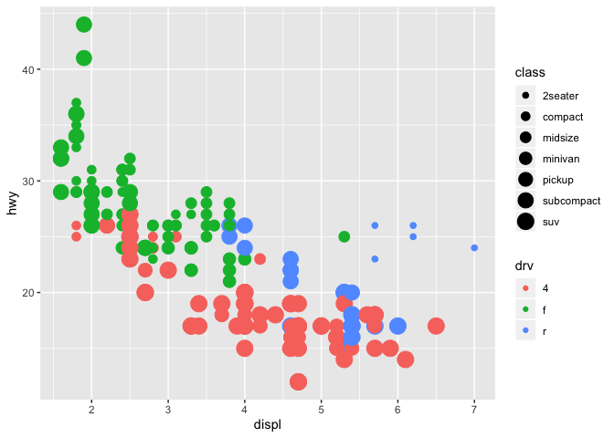<!-- -->

# Seminar Material

To see what the `mpg` dataset looks like:

``` r
mpg
```

    ## # A tibble: 234 x 11
    ##    manufacturer model    displ  year   cyl trans   drv     cty   hwy fl    class
    ##    <chr>        <chr>    <dbl> <int> <int> <chr>   <chr> <int> <int> <chr> <chr>
    ##  1 audi         a4         1.8  1999     4 auto(l… f        18    29 p     comp…
    ##  2 audi         a4         1.8  1999     4 manual… f        21    29 p     comp…
    ##  3 audi         a4         2    2008     4 manual… f        20    31 p     comp…
    ##  4 audi         a4         2    2008     4 auto(a… f        21    30 p     comp…
    ##  5 audi         a4         2.8  1999     6 auto(l… f        16    26 p     comp…
    ##  6 audi         a4         2.8  1999     6 manual… f        18    26 p     comp…
    ##  7 audi         a4         3.1  2008     6 auto(a… f        18    27 p     comp…
    ##  8 audi         a4 quat…   1.8  1999     4 manual… 4        18    26 p     comp…
    ##  9 audi         a4 quat…   1.8  1999     4 auto(l… 4        16    25 p     comp…
    ## 10 audi         a4 quat…   2    2008     4 manual… 4        20    28 p     comp…
    ## # … with 224 more rows

To plot `mpg`:

``` r
ggplot(data = mpg) + 
  geom_point(mapping = aes(x = displ, y = hwy))
```

<!-- -->

To add a third variable:

``` r
ggplot(data = mpg) + 
  geom_point(mapping = aes(x = displ, y = hwy, color = class))
```

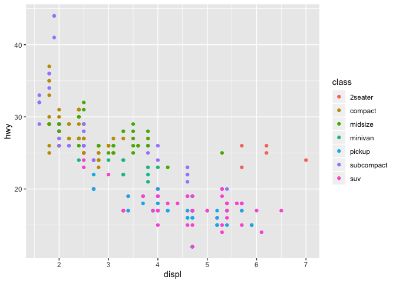<!-- -->

Trying out `size` as the third variable:

``` r
ggplot(data = mpg) + 
  geom_point(mapping = aes(x = displ, y = hwy, size = class))
```

    ## Warning: Using size for a discrete variable is not advised.

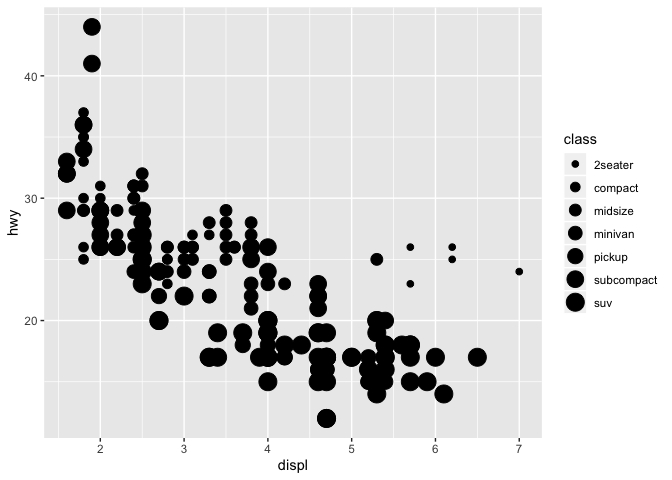<!-- -->

To change the colour of ALL points regardless of any properties:

``` r
ggplot(data = mpg) + 
  geom_point(mapping = aes(x = displ, y = hwy), color = "blue")
```

<!-- -->

To see all the available `geom`
    functions:

``` r
apropos("^geom_")
```

    ##  [1] "geom_abline"     "geom_area"       "geom_bar"        "geom_bin2d"     
    ##  [5] "geom_blank"      "geom_boxplot"    "geom_col"        "geom_contour"   
    ##  [9] "geom_count"      "geom_crossbar"   "geom_curve"      "geom_density"   
    ## [13] "geom_density_2d" "geom_density2d"  "geom_dotplot"    "geom_errorbar"  
    ## [17] "geom_errorbarh"  "geom_freqpoly"   "geom_hex"        "geom_histogram" 
    ## [21] "geom_hline"      "geom_jitter"     "geom_label"      "geom_line"      
    ## [25] "geom_linerange"  "geom_map"        "geom_path"       "geom_point"     
    ## [29] "geom_pointrange" "geom_polygon"    "geom_qq"         "geom_qq_line"   
    ## [33] "geom_quantile"   "geom_raster"     "geom_rect"       "geom_ribbon"    
    ## [37] "geom_rug"        "geom_segment"    "geom_sf"         "geom_sf_label"  
    ## [41] "geom_sf_text"    "geom_smooth"     "geom_spoke"      "geom_step"      
    ## [45] "geom_text"       "geom_tile"       "geom_violin"     "geom_vline"

To see all the available `stat`
    functions:

``` r
apropos("^stat_")
```

    ##  [1] "stat_bin"            "stat_bin_2d"         "stat_bin_hex"       
    ##  [4] "stat_bin2d"          "stat_binhex"         "stat_boxplot"       
    ##  [7] "stat_contour"        "stat_count"          "stat_density"       
    ## [10] "stat_density_2d"     "stat_density2d"      "stat_ecdf"          
    ## [13] "stat_ellipse"        "stat_function"       "stat_identity"      
    ## [16] "stat_qq"             "stat_qq_line"        "stat_quantile"      
    ## [19] "stat_sf"             "stat_sf_coordinates" "stat_smooth"        
    ## [22] "stat_spoke"          "stat_sum"            "stat_summary"       
    ## [25] "stat_summary_2d"     "stat_summary_bin"    "stat_summary_hex"   
    ## [28] "stat_summary2d"      "stat_unique"         "stat_ydensity"

To see all the available `scale` functions:

``` r
apropos("^scale_")
```

    ##  [1] "scale_alpha"               "scale_alpha_continuous"   
    ##  [3] "scale_alpha_date"          "scale_alpha_datetime"     
    ##  [5] "scale_alpha_discrete"      "scale_alpha_identity"     
    ##  [7] "scale_alpha_manual"        "scale_alpha_ordinal"      
    ##  [9] "scale_color_brewer"        "scale_color_continuous"   
    ## [11] "scale_color_discrete"      "scale_color_distiller"    
    ## [13] "scale_color_gradient"      "scale_color_gradient2"    
    ## [15] "scale_color_gradientn"     "scale_color_grey"         
    ## [17] "scale_color_hue"           "scale_color_identity"     
    ## [19] "scale_color_manual"        "scale_color_viridis_c"    
    ## [21] "scale_color_viridis_d"     "scale_colour_brewer"      
    ## [23] "scale_colour_continuous"   "scale_colour_date"        
    ## [25] "scale_colour_datetime"     "scale_colour_discrete"    
    ## [27] "scale_colour_distiller"    "scale_colour_gradient"    
    ## [29] "scale_colour_gradient2"    "scale_colour_gradientn"   
    ## [31] "scale_colour_grey"         "scale_colour_hue"         
    ## [33] "scale_colour_identity"     "scale_colour_manual"      
    ## [35] "scale_colour_ordinal"      "scale_colour_viridis_c"   
    ## [37] "scale_colour_viridis_d"    "scale_continuous_identity"
    ## [39] "scale_discrete_identity"   "scale_discrete_manual"    
    ## [41] "scale_fill_brewer"         "scale_fill_continuous"    
    ## [43] "scale_fill_date"           "scale_fill_datetime"      
    ## [45] "scale_fill_discrete"       "scale_fill_distiller"     
    ## [47] "scale_fill_gradient"       "scale_fill_gradient2"     
    ## [49] "scale_fill_gradientn"      "scale_fill_grey"          
    ## [51] "scale_fill_hue"            "scale_fill_identity"      
    ## [53] "scale_fill_manual"         "scale_fill_ordinal"       
    ## [55] "scale_fill_viridis_c"      "scale_fill_viridis_d"     
    ## [57] "scale_linetype"            "scale_linetype_continuous"
    ## [59] "scale_linetype_discrete"   "scale_linetype_identity"  
    ## [61] "scale_linetype_manual"     "scale_radius"             
    ## [63] "scale_shape"               "scale_shape_continuous"   
    ## [65] "scale_shape_discrete"      "scale_shape_identity"     
    ## [67] "scale_shape_manual"        "scale_shape_ordinal"      
    ## [69] "scale_size"                "scale_size_area"          
    ## [71] "scale_size_continuous"     "scale_size_date"          
    ## [73] "scale_size_datetime"       "scale_size_discrete"      
    ## [75] "scale_size_identity"       "scale_size_manual"        
    ## [77] "scale_size_ordinal"        "scale_type"               
    ## [79] "scale_x_continuous"        "scale_x_date"             
    ## [81] "scale_x_datetime"          "scale_x_discrete"         
    ## [83] "scale_x_log10"             "scale_x_reverse"          
    ## [85] "scale_x_sqrt"              "scale_x_time"             
    ## [87] "scale_y_continuous"        "scale_y_date"             
    ## [89] "scale_y_datetime"          "scale_y_discrete"         
    ## [91] "scale_y_log10"             "scale_y_reverse"          
    ## [93] "scale_y_sqrt"              "scale_y_time"

To add a smooth line (regression with loess) for `engine size` vs `fuel
efficiency`:

``` r
ggplot(data = mpg, 
       mapping = aes(x = displ, y = hwy)) +
  geom_point() +
  geom_smooth()
```

    ## `geom_smooth()` using method = 'loess' and formula 'y ~ x'

<!-- -->

Adding the mapping to both `geom_point` and `geom_smooth` will result in
the same plot as having it in `ggplot`:

``` r
ggplot(data = mpg) +
  geom_point(mapping = aes(x = displ, y = hwy)) +
  geom_smooth(mapping = aes(x = displ, y = hwy))
```

    ## `geom_smooth()` using method = 'loess' and formula 'y ~ x'

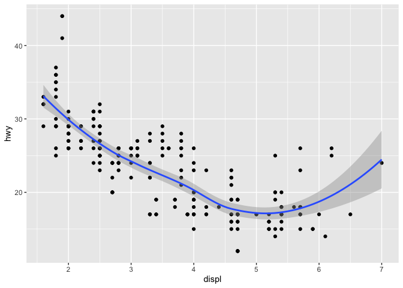<!-- -->

To add a continuous variable as the third dimension:

``` r
ggplot(data = mpg, 
       mapping = aes(x = displ, y = hwy, color = year)) +
  geom_point() +
  geom_smooth()
```

    ## `geom_smooth()` using method = 'loess' and formula 'y ~ x'

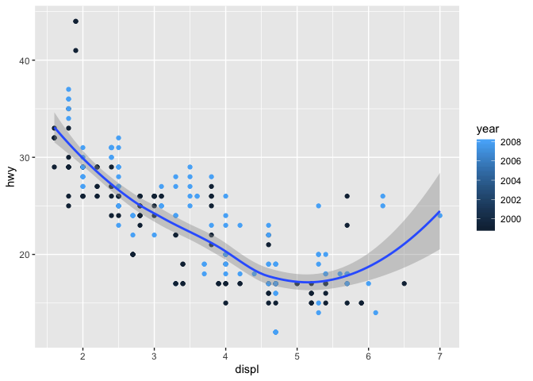<!-- -->

What happens if you add a third discrete variable?

``` r
ggplot(data = mpg, 
       mapping = aes(x = displ, y = hwy, color = trans)) +
  geom_point() +
  geom_smooth()
```

    ## `geom_smooth()` using method = 'loess' and formula 'y ~ x'

    ## Warning in simpleLoess(y, x, w, span, degree = degree, parametric =
    ## parametric, : span too small. fewer data values than degrees of freedom.

    ## Warning in simpleLoess(y, x, w, span, degree = degree, parametric =
    ## parametric, : pseudoinverse used at 1.9925

    ## Warning in simpleLoess(y, x, w, span, degree = degree, parametric =
    ## parametric, : neighborhood radius 1.1075

    ## Warning in simpleLoess(y, x, w, span, degree = degree, parametric =
    ## parametric, : reciprocal condition number 0

    ## Warning in simpleLoess(y, x, w, span, degree = degree, parametric =
    ## parametric, : There are other near singularities as well. 0.16606

    ## Warning in predLoess(object$y, object$x, newx = if
    ## (is.null(newdata)) object$x else if (is.data.frame(newdata))
    ## as.matrix(model.frame(delete.response(terms(object)), : span too small. fewer
    ## data values than degrees of freedom.

    ## Warning in predLoess(object$y, object$x, newx = if
    ## (is.null(newdata)) object$x else if (is.data.frame(newdata))
    ## as.matrix(model.frame(delete.response(terms(object)), : pseudoinverse used at
    ## 1.9925

    ## Warning in predLoess(object$y, object$x, newx = if
    ## (is.null(newdata)) object$x else if (is.data.frame(newdata))
    ## as.matrix(model.frame(delete.response(terms(object)), : neighborhood radius
    ## 1.1075

    ## Warning in predLoess(object$y, object$x, newx = if
    ## (is.null(newdata)) object$x else if (is.data.frame(newdata))
    ## as.matrix(model.frame(delete.response(terms(object)), : reciprocal condition
    ## number 0

    ## Warning in predLoess(object$y, object$x, newx = if
    ## (is.null(newdata)) object$x else if (is.data.frame(newdata))
    ## as.matrix(model.frame(delete.response(terms(object)), : There are other near
    ## singularities as well. 0.16606

    ## Warning in simpleLoess(y, x, w, span, degree = degree, parametric =
    ## parametric, : span too small. fewer data values than degrees of freedom.

    ## Warning in simpleLoess(y, x, w, span, degree = degree, parametric =
    ## parametric, : at 1.797

    ## Warning in simpleLoess(y, x, w, span, degree = degree, parametric =
    ## parametric, : radius 9e-06

    ## Warning in simpleLoess(y, x, w, span, degree = degree, parametric =
    ## parametric, : all data on boundary of neighborhood. make span bigger

    ## Warning in simpleLoess(y, x, w, span, degree = degree, parametric =
    ## parametric, : pseudoinverse used at 1.797

    ## Warning in simpleLoess(y, x, w, span, degree = degree, parametric =
    ## parametric, : neighborhood radius 0.003

    ## Warning in simpleLoess(y, x, w, span, degree = degree, parametric =
    ## parametric, : reciprocal condition number 1

    ## Warning in simpleLoess(y, x, w, span, degree = degree, parametric =
    ## parametric, : at 2.403

    ## Warning in simpleLoess(y, x, w, span, degree = degree, parametric =
    ## parametric, : radius 9e-06

    ## Warning in simpleLoess(y, x, w, span, degree = degree, parametric =
    ## parametric, : all data on boundary of neighborhood. make span bigger

    ## Warning in simpleLoess(y, x, w, span, degree = degree, parametric =
    ## parametric, : There are other near singularities as well. 9e-06

    ## Warning in simpleLoess(y, x, w, span, degree = degree, parametric =
    ## parametric, : zero-width neighborhood. make span bigger
    
    ## Warning in simpleLoess(y, x, w, span, degree = degree, parametric =
    ## parametric, : zero-width neighborhood. make span bigger

    ## Warning: Computation failed in `stat_smooth()`:
    ## NA/NaN/Inf in foreign function call (arg 5)

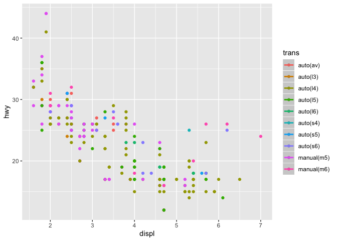<!-- -->

Finding average fuel efficiency for each class:

``` r
(averageEfficiency <- 
  mpg %>% group_by(class) %>% summarise(fuel_efficiency = mean(hwy)))
```

    ## # A tibble: 7 x 2
    ##   class      fuel_efficiency
    ##   <chr>                <dbl>
    ## 1 2seater               24.8
    ## 2 compact               28.3
    ## 3 midsize               27.3
    ## 4 minivan               22.4
    ## 5 pickup                16.9
    ## 6 subcompact            28.1
    ## 7 suv                   18.1

To use `geom_bar` with specific heights, use `stat = identity`:

``` r
ggplot(averageEfficiency) + 
  geom_bar(aes(x = class, y = fuel_efficiency),
           stat = "identity")
```

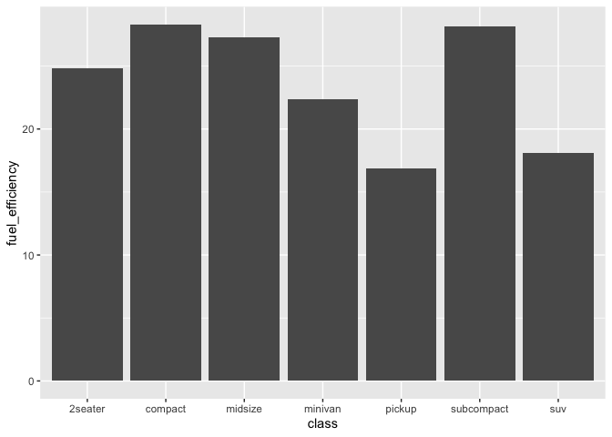<!-- -->

To add colour to the bar chart:

``` r
ggplot(averageEfficiency) + 
  geom_bar(aes(x = class, y = fuel_efficiency, fill = class),
           stat = "identity")
```

<!-- -->

To specify the x-axis and y-axis labels:

``` r
ggplot(averageEfficiency) + 
  geom_bar(aes(x = class, y = fuel_efficiency, fill = class),
           stat = "identity") +
  ylab("Fuel Efficiency (miles per gallon)") +
  xlab("Vehicle Type")
```

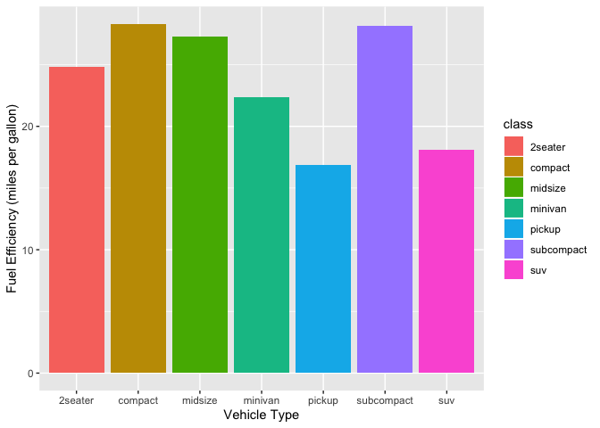<!-- -->

To reverse the y-scale:

``` r
ggplot(averageEfficiency) + 
  geom_bar(aes(x = class, y = fuel_efficiency, fill = class),
           stat = "identity") +
  ylab("Fuel Efficiency (miles per gallon)") +
  xlab("Vehicle Type") +
  scale_y_reverse()
```

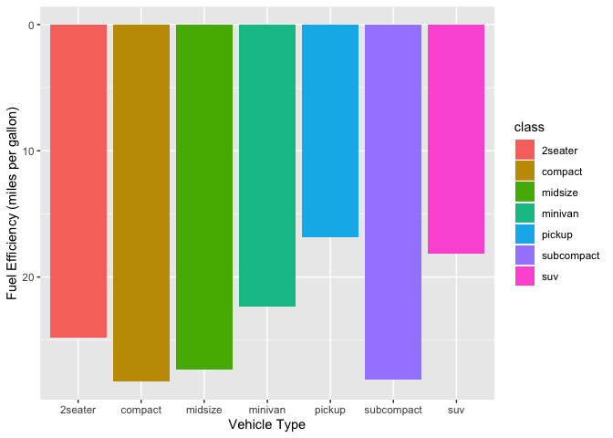<!-- -->

To add to the coordinate system default `coord_cartesian` with
`coord_flip`:

``` r
ggplot(averageEfficiency) + 
  geom_bar(aes(x = class, y = fuel_efficiency, fill = class),
           stat = "identity") +
  coord_flip()
```

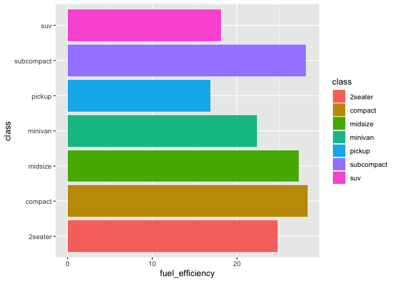<!-- -->

How about `coord_polar`?

``` r
ggplot(averageEfficiency) + 
  geom_bar(aes(x = class, y = fuel_efficiency, fill = class),
           stat = "identity") +
  coord_polar()
```

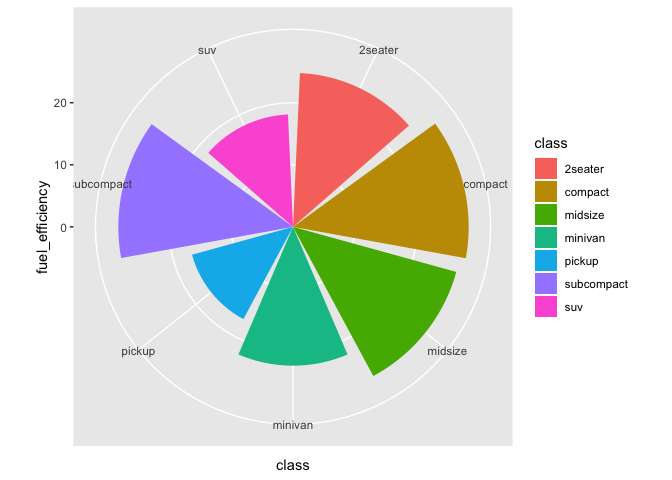<!-- -->

To facet the original scatter plot by `class`:

``` r
ggplot(data = mpg, 
       mapping = aes(x = displ, y = hwy)) +
  geom_point() +
  facet_wrap(~class)
```

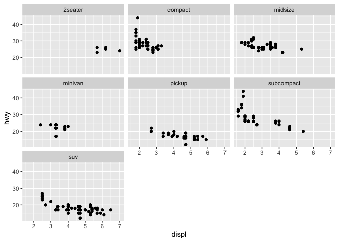<!-- -->
