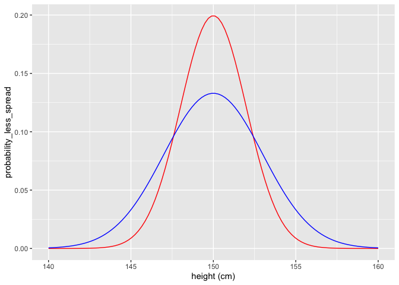
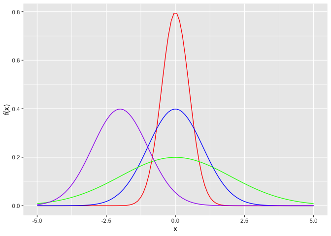
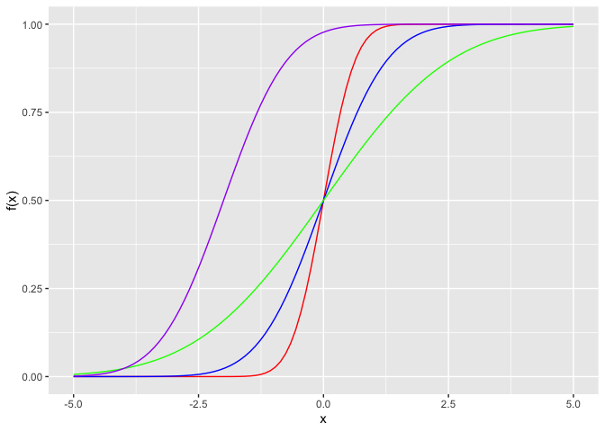
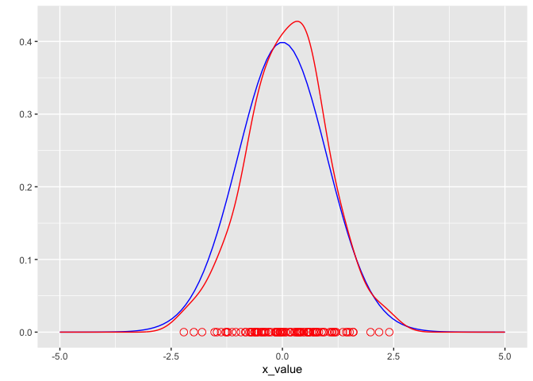
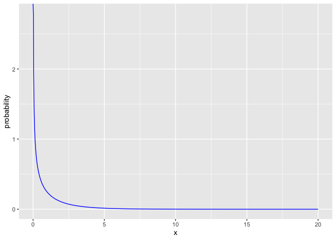
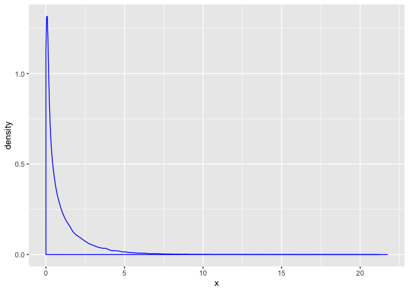
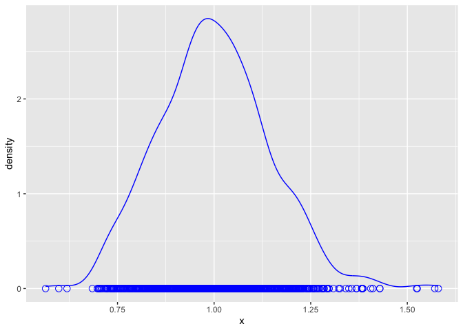
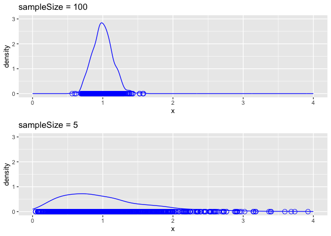
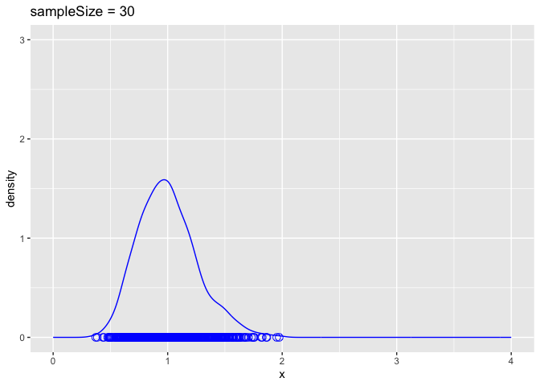
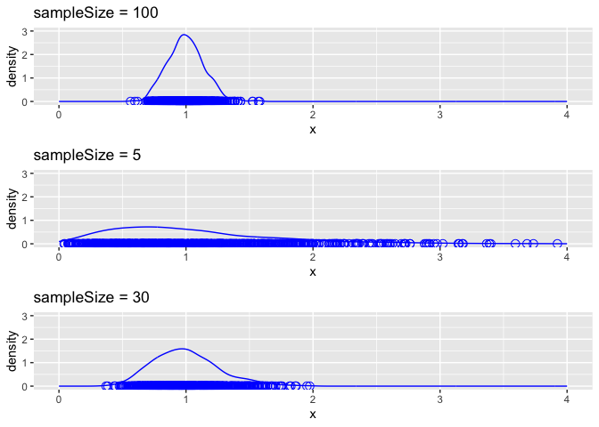

Seminar 02c: Probability and Simulations
================
Diana Lin
20/01/2020

Load the libraries:

``` r
library(tidyverse)
library(gridExtra)
```

**ATTENTION**: To jump down to the deliverable, please click
[here](#part-3:-deliverable).

## Part 1: The Normal Distribution

### What is a normal distribution?

To illustrate this, here is a visualization showing two normal
distributions. The blue line plots the probability distribution of a
normal distribution with a larger standard deviation (more spread)
whereas the red line plots one with a smaller standard deviation (less
spread). Both distributions have a mean of 150:

``` r
all_possible_heights <- seq(from = 140, to = 160, length = 100)
probability_values_less_spread <- dnorm(all_possible_heights, mean = 150, sd = 2)
probability_values_more_spread <- dnorm(all_possible_heights, mean = 150, sd = 3)

tibble(height = all_possible_heights, 
       probability_less_spread = probability_values_less_spread,
       probability_more_spread = probability_values_more_spread) %>% 
  ggplot() +
  geom_line(aes(x = height, y = probability_less_spread), color = "red") +
  geom_line(aes(x = height, y = probability_more_spread), color = "blue") +
  xlab("height (cm)")
```

<!-- -->

### The probability density function

**Question**: From the code, can you figure out which color corresponds
to which set of parameters? (mean & standard deviation)

``` r
xValues <- seq(from = -5, to = 5, length = 100)
plotA <- dnorm(xValues, mean = 0, sd = 0.5) #
plotB <- dnorm(xValues, mean = 0, sd = 1)
plotC <- dnorm(xValues, mean = 0, sd = 2)
plotD <-  dnorm(xValues, mean = -2, sd = 1)

normalDistributionsTibble <- tibble(x_value = xValues, 
                                    red_value = plotA,
                                    blue_value = plotB,
                                    green_value = plotC,
                                    purple_value = plotD)

p <- normalDistributionsTibble %>% ggplot()
p + 
  geom_line(aes(x = xValues, y = red_value), color = "red") +
  geom_line(aes(x = xValues, y = blue_value), color = "blue") +
  geom_line(aes(x = xValues, y = green_value), color = "green") +
  geom_line(aes(x = xValues, y = purple_value), color = "purple") +
  xlab("x") +
  ylab("f(x)")
```

<!-- -->

**Answer**:

  - Plot A: `mean = 0` and `sd = 0.5`: Red
  - Plot B: `mean = 0` and `sd = 1`: Blue
  - Plot C: `mean = 0` and `sd = 2`: Green
  - Plot D: `mean = -2` and `sd = 1`: Purple

### The Cumulative Distribution Function (CDF)

Here we show the visualization of CDFs for the normal distribution with
different means and standard deviations.

``` r
xValues <- seq(from = -5, to = 5, length = 100)
plotA <- pnorm(xValues, mean = 0, sd = 0.5)
plotB <-  pnorm(xValues, mean = 0, sd = 1)
plotC <-  pnorm(xValues, mean = 0, sd = 2)
plotD <-  pnorm(xValues, mean = -2, sd = 1)

normalDistributionsTibble <- tibble(x_value = xValues, 
                                    red_value = plotA,
                                    blue_value = plotB,
                                    green_value = plotC,
                                    purple_value = plotD)

p <- normalDistributionsTibble %>% ggplot()
p + 
  geom_line(aes(x = xValues, y = red_value), color = "red") +
  geom_line(aes(x = xValues, y = blue_value), color = "blue") +
  geom_line(aes(x = xValues, y = green_value), color = "green") +
  geom_line(aes(x = xValues, y = purple_value), color = "purple") +
  xlab("x") +
  ylab("f(x)")
```

<!-- -->

### Simulation vs. perfect distribution

Here we demonstrate usage of this function. We overlap the resulting
density plot with true distribution. Notice how they line up:

``` r
meanValue <- 0
standardDeviation <- 1
numVals <- 100

xValues <- seq(from = -5, to = 5, length = numVals)
trueDistribution <- dnorm(xValues, mean = meanValue, sd = standardDeviation)

dataFrame <- tibble(x_value = xValues, true_value = trueDistribution)

set.seed(1)
randomVals <- rnorm(numVals, mean = meanValue, sd = standardDeviation)

dataFrame %>% ggplot() +
    geom_line(aes(x = x_value, y = true_value), color = "blue") +
    geom_line(aes(x = randomVals), color = "red", stat = "density") +
    geom_point(aes(x = randomVals, y = 0), color = "red", shape = 1, size = 3) +
    ylab("")
```

<!-- -->

## Part 2: The Central Limit Theorem (CLT)

### The chi-square distrbution

To demonstrate the CLT, we will generate the original sample values from
the chi-square distribution. But first, let’s see what the chi-square
distribution looks like:

``` r
degreeFreedom <- 1

xValues <- seq(from = 0, to = 20, length = 1000)
probabilityValues <- dchisq(xValues, df = degreeFreedom)

dataFrame <- tibble(x = xValues, 
                    probability = probabilityValues)

dataFrame %>% ggplot() +
  geom_line(aes(x = x, y = probability), color = "blue")
```

<!-- -->

### Simulating many samples

We will now generate 1000 sample, each sample will consist of 100 random
values. We then calculate the sample means for each of the 1000 sample
generated. We then look at the distribution of the 1000 means
values.

``` r
# this is a trick to make the random values reproducible - note that computers are unable to produce truly random values. They can only generate pseudorandom values by using a seed, usually the current time, as it varies from moment to moment. By setting the seed ourselves, we make the random values repeatable. 
set.seed(1)

sampleSize <- 100
numSamples <- 1000

degreeFreedom <- 1

randomChiSqValues <- rchisq(n = numSamples * sampleSize, df = degreeFreedom)
```

First let’s take a look at the distribution of all randomly generated
values. This is 100 \* 1000 = 100000 values sampled from the chi-square
distribution.

``` r
tibble(x = randomChiSqValues) %>% 
  ggplot() + 
  geom_density(aes(x = x), color = "blue")
```

<!-- -->

### Convergence to the normal distribution

Ok, now let’s separate all these values into 1000 samples, and then work
out the sample means and look at the distribution of that.

``` r
# organize the random values into 1000 sample rows of size n = 5 columns
samples <- matrix(randomChiSqValues, nrow = numSamples, ncol = sampleSize)
sampleMeans <- rowMeans(samples) # work out the sample means 

head(sampleMeans)
```

    ## [1] 1.0797031 1.1752284 0.9261440 0.9416424 0.9380011 1.1191603

Great, now we have the sample means. Let’s check their distribution.

``` r
tibble(x = sampleMeans) %>% 
  ggplot() + 
  geom_line(aes(x = x), stat = "density", color = "blue") +
  geom_point(aes(x = x, y = 0), color = "blue", shape = 1, size = 3)
```

<!-- -->

## Part 3: Deliverable

**Question**: How well does the CTL hold for smaller sample sizes? Try
it with sample sizes of n = 5, keep the number of samples the same at
1000.

Here I set the sample size to 5:

``` r
set.seed(1)

sampleSize <- 5
numSamples <- 1000

degreeFreedom <- 1

randomChiSqValues <- rchisq(n = numSamples * sampleSize, df = degreeFreedom)

samples <- matrix(randomChiSqValues, nrow = numSamples, ncol = sampleSize)
sampleMeans <- rowMeans(samples)

tibble(x = sampleMeans) %>% 
  ggplot() + 
  geom_line(aes(x = x), stat = "density", color = "blue") +
  geom_point(aes(x = x, y = 0), color = "blue", shape = 1, size = 3)
```

<!-- -->

Let’s compare them. I’ve set the x and y-axis limits to be the same for
a fair visual comparison.

``` r
# sample size = 100
set.seed(1)

sampleSize <- 100
numSamples <- 1000

degreeFreedom <- 1

randomChiSqValues <- rchisq(n = numSamples * sampleSize, df = degreeFreedom)

samples <- matrix(randomChiSqValues, nrow = numSamples, ncol = sampleSize)
sampleMeans <- rowMeans(samples) # work out the sample means 

a <- tibble(x = sampleMeans) %>% 
  ggplot() + 
  geom_line(aes(x = x), stat = "density", color = "blue") +
  geom_point(aes(x = x, y = 0), color = "blue", shape = 1, size = 3) +
  ylim(c(0,3)) +
  xlim(c(0,4)) +
  ggtitle("sampleSize = 100")

# sample size = 5
set.seed(1)

sampleSize <- 5
numSamples <- 1000

degreeFreedom <- 1

randomChiSqValues <- rchisq(n = numSamples * sampleSize, df = degreeFreedom)

samples <- matrix(randomChiSqValues, nrow = numSamples, ncol = sampleSize)
sampleMeans <- rowMeans(samples)

b <- tibble(x = sampleMeans) %>% 
  ggplot() + 
  geom_line(aes(x = x), stat = "density", color = "blue") +
  geom_point(aes(x = x, y = 0), color = "blue", shape = 1, size = 3) +
  ylim(c(0,3)) +
  xlim(c(0,4)) +
  ggtitle("sampleSize = 5")

grid.arrange(a,b,ncol=1)
```

<!-- -->

**Answer:** The CLT does not hold for smaller sample sizes. The CLT only
holds optimally for sample sizes of at least size 30, as demonstrated
below.

``` r
# sample size = 30
set.seed(1)

sampleSize <- 30
numSamples <- 1000

degreeFreedom <- 1

randomChiSqValues <- rchisq(n = numSamples * sampleSize, df = degreeFreedom)

samples <- matrix(randomChiSqValues, nrow = numSamples, ncol = sampleSize)
sampleMeans <- rowMeans(samples)

(c <- tibble(x = sampleMeans) %>% 
  ggplot() + 
  geom_line(aes(x = x), stat = "density", color = "blue") +
  geom_point(aes(x = x, y = 0), color = "blue", shape = 1, size = 3) +
  xlim(c(0,4)) +
  ylim(c(0,3)) + 
  ggtitle("sampleSize = 30"))
```

<!-- -->

Let’s stack all three plots together for comparison:

``` r
grid.arrange(a,b,c,ncol=1)
```

<!-- -->
