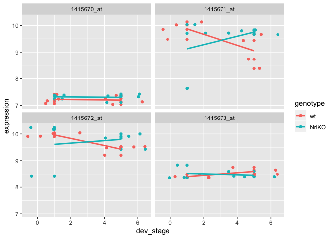

```{r setup, include=FALSE}
knitr::opts_chunk$set(echo = TRUE)
```
## Deliverable
Here is the deliverable:


To see the code, please click [here](#deliverables).

## Gene Expression Data
Load the packages:
```{r load}
library(tidyverse)
library(limma)
library(reshape2)
library(knitr)
```

### Import Data

Load the expression matrix:
```{r import}
expressionMatrix <-
  read.table(
    "expression_data/GSE4051_data.tsv",
    stringsAsFactors = FALSE,
    sep = "\t",
    quote = ""
  )
expressionMatrix <-
  expressionMatrix %>% rownames_to_column("gene") # rownames deprecated in tibbles and are hard to work with in ggplot
expressionMatrix <-
  expressionMatrix %>% as_tibble() # turn into tibble for pretty printing

expressionMatrix
```

Load the sample metadata:
```{r sample}
samplesMetadata <- read.table(
  "expression_data/GSE4051_design.tsv",
  sep = "\t",
  header = TRUE,
  # set header = TRUE to use the first row of the data as column names
  stringsAsFactors = FALSE
) # set stringAsFactors to avoid setting everything as factors, we can control that ourselves

samplesMetadata <-
  samplesMetadata %>% as_tibble() # turn into tibble for pretty printing

# define our own column names for samples metadata for clarity
names(samplesMetadata) <-
  c("sample_id", "sample_number", "dev_stage", "genotype")

samplesMetadata
```

Turn `devStage` and `gType` into factors:
```{r factor}
samplesMetadata$dev_stage <- samplesMetadata$dev_stage %>% factor(levels = c("E16", "P2", "P6", "P10", "4_weeks"))
samplesMetadata$dev_stage # note that Levels contain all possible categories of the variable

samplesMetadata$genotype <- samplesMetadata$genotype %>% factor(levels = c("wt", "NrlKO"))
samplesMetadata$genotype # note that Levels contain all possible categories of the variable
```

The updated dataframe:
```{r updated}
samplesMetadata
```

Santiy check to make sure the samples match between the two data frames:
```{r sanity}
expressionMatrix %>% ncol() - 1 # number of samples in the expression matrix (- column for genes)
samplesMetadata %>% nrow() # number of samples in the samples metadata 
expressionMatrix %>% names() %>% sort()
samplesMetadata$sample_id %>% sort()
```

The samples in both data frames match.

### Plotting Gene Expression

Use `melt()` to convert data frame into a `ggplot()` workable form:

```{r melt}
# melt into a format ggplot can easily work with
meltedExpressionMatrix <- expressionMatrix %>% melt(id = "gene") 
```

Boxplot using `geom_boxplot()`:
```{r boxplot}
meltedExpressionMatrix %>% 
  ggplot(aes(x = variable, y = value)) +
  geom_boxplot() +
  theme(axis.text.x = element_text(angle = 90, hjust = 1))
```

Density plot using `geom_density()`:
```{r density plot}
meltedExpressionMatrix %>% 
  ggplot(aes(x = value, color = variable)) +
  geom_density() +
  theme(axis.text.x = element_text(angle = 90, hjust = 1))
```

## Single Gene Analysis

Taking a closer look at gene `1429226_at`:

```{r 1429226_at}
geneIds <- c("1416119_at", "1431708_a_at")

# use dplyr::filter() to get the expression data for the gene
expressionDataForGene <- expressionMatrix %>% filter(gene %in% geneIds)

# transform the data frame into the format that matches the sample metadata
expressionDataForGene <- expressionDataForGene %>%
  as.data.frame() %>% 
  column_to_rownames("gene") %>%
  t() %>% as.data.frame() %>% 
  rownames_to_column("sample_id") %>% 
  melt(id = "sample_id") %>% 
  as_tibble() %>% 
  select(sample_id,
         gene = variable, 
         expression = value)

expressionDataForGene
```

Put the data transformation above into a function:
```{r fx}
transformGeneExpressionMatrix <- function(expressionMatrix) {
  expressionMatrix <- expressionMatrix %>%
    as.data.frame() %>% 
    column_to_rownames("gene") %>%
    t() %>% as.data.frame() %>% 
    rownames_to_column("sample_id") %>% 
    melt(id = "sample_id") %>% 
    as_tibble() %>% 
    select(sample_id,
           gene = variable, 
           expression = value)
  return(expressionMatrix)
}
```

Filter for specific gene:
```{r gene}
# use dplyr::filter() to get the expression data for the gene
expressionDataForGene <- expressionMatrix %>% filter(gene %in% geneIds)

# this is the original expression matrix, consisting of only the one gene we filtered for
expressionDataForGene
```

Use the function above to transform the data:
```{r function}
expressionDataForGene <- transformGeneExpressionMatrix(expressionDataForGene)
expressionDataForGene
```

Integrate the data frames by joining:
```{r}
expressionDataForGene <- expressionDataForGene %>% left_join(samplesMetadata, by = "sample_id")

expressionDataForGene
```

Looking at two genes:

```{r 2genes}
expressionDataForGene %>% 
  ggplot(aes(x = expression, y = genotype, color = genotype)) + 
  geom_point(size = 3, shape = 1) +
  facet_wrap(~gene)
```

**Question:** Take a moment to look at these plots. Do you think one of these genes is differentially expressed across wt and NrlKO conditions?

**Answer:** `1431708_a_at` looks differentially expressed because the mean of the dots for the knockout is around 7.5, whereas the mean for the wildtype is around 10.

### The two-group t-test

Do a t-test to compare the expression values across the two genotypes for `1416119_at`, aka "the boring gene":

```{r boring gene}
boringGene <- expressionDataForGene %>% filter(gene == "1416119_at")
t.test(expression ~ genotype, boringGene)
```

The p-value is > 0.8, as expected since it is probably not differentially expressed, hence 'boring'.

Do a t-test to compare the expression values across the two genotypes for `1431708_a_at`, aka "the interesting gene":

```{r interesting gene}
interestingGene <- expressionDataForGene %>% filter(gene == "1431708_a_at")
t.test(expression ~ genotype, interestingGene)
```

This p-value is < 7.381e-12. Even if the significance threshold was set to 0.0001, this result would still be significant!

### The mighty linear regression

Linear regression for the boring gene:

```{r lm boring}
boringGene <- expressionDataForGene %>% filter(gene == "1416119_at")
summary(lm(expression ~ genotype, boringGene))
```

Linear regression for the interesting gene:
```{r lm interesting}
interestingGene <- expressionDataForGene %>% filter(gene == "1431708_a_at")
summary(lm(expression ~ genotype, interestingGene))
```

Using ANOVA to test if at least one developmental stage is different among all developmental stages (multiple groups) for `1431708_a_at` (the interesting gene):

```{r anova}
interestingGene <- expressionDataForGene %>% filter(gene == "1431708_a_at")
summary(aov(expression ~ dev_stage, interestingGene))
```

The same analysis but with linear regression:
```{r lm gene}
interestingGene <- expressionDataForGene %>% filter(gene == "1431708_a_at")
summary(lm(expression ~ dev_stage, interestingGene))
```

## Lots of genes (the high-throughput approach)

### Bad variance estimates

Here we provide a data simulation to illustrate why gene variance estimates are bad in gene expression data. We simulate data for 3 samples, each with expression for 1000 genes. We then calculate the variance for each gene give the three samples. Finally, we look at the distribution of these variance estimates.

```{r demo}
numberOfGenes <- 1000
numberOfSamples <- 3

# each row is a gene, each column is a sample
simulatedGeneExpressionMatrix <- matrix(rnorm(numberOfGenes * numberOfSamples), nrow = numberOfGenes) 
simulatedGeneExpressionMatrix %>% head()

geneVars <- simulatedGeneExpressionMatrix %>% apply(1, var) # work out the variance for each gene

tibble(variance = geneVars) %>% 
  ggplot(aes(x = variance)) + 
  geom_density() +
  geom_point(aes(y = 0), shape = 1, size = 3)
```

Some variances extremely small and extremely large.

### Limma in action

Looking for genes differentially expressed across different developmental stages:
```{r limma prep}
# filter for wildtype data
wildTypeSamples <- samplesMetadata %>% filter(genotype == "wt")

wildTypeSamples # reminder of what the samples metadata data frame looks like

# reusable function for pulling expression data for given samples
getExpressionForSamples <- function(sampleIds, expressionMatrix) {
  # use gene column as row name
  dataFrame <- expressionMatrix %>% 
    as.data.frame() %>% 
    column_to_rownames("gene")
  # use give sampleIds to pull out the subset of interest (ORDERING OF SAMPLES IS VERY IMPORTANT)
  return(dataFrame[sampleIds])
}

# use the wildTypeSamples to pull out the wildtype expression data from the expression matrix
wildTypeExpressionMatrix <- getExpressionForSamples(wildTypeSamples$sample_id, expressionMatrix)

wildTypeExpressionMatrix %>% as_tibble() # reminder of what the expression matrix looks like
```

Make sure that everything is ordered together and in sync:
```{r order}
# Ordering of samples in the samples metadata
wildTypeSamples$sample_id

# Ordering of samples in the expression matrix
names(wildTypeExpressionMatrix)

# check equivalence
(wildTypeSamples$sample_id == names(wildTypeExpressionMatrix)) %>% all()
```

Constructing the design matrix:
```{r}
designMatrix <- model.matrix(~dev_stage, wildTypeSamples)
head(designMatrix, 10) %>% kable()
head(wildTypeSamples, 10) %>% kable()
```

Fitting the model:
```{r fit}
# keep the fit around as we will need to it for looking at other contrasts later 
wildTypeDevStageFit <- lmFit(wildTypeExpressionMatrix, designMatrix)

# run ebayes to calculate moderated t-statistics
wildTypeDevStageFitEb <- eBayes(wildTypeDevStageFit)
```

### `topTable()` is your best friend

```{r toptable}
topTenGenes <- topTable(wildTypeDevStageFitEb)
topTenGenes
```

Use `transformGeneExpressionMatrix()` function from above:
```{r trans fx}
topGenes <- rownames(topTenGenes)[1:6]
topGenesExpressionData <- wildTypeExpressionMatrix %>% 
  rownames_to_column("gene") %>% 
  filter(gene %in% topGenes) %>%
  transformGeneExpressionMatrix() %>% 
  left_join(wildTypeSamples, id = "sample_id")

topGenesExpressionData # reminder of formatted expression data looks like - for easy graphing
```

Plotting the top gene expression:
```{r top gene ex}
topGenesExpressionData %>% 
  ggplot(aes(x = dev_stage, y = expression, color = genotype)) +
  geom_point() +
  geom_jitter() +
  stat_summary(aes(y = expression, group=1), fun.y = mean, geom="line") +
  facet_wrap(~gene)
```

Write the above graphing code into a reusable function:
```{r write function}
plotGenes <- function(genes, expressionMatrix, samplesMetadata) {
  
  expressionDataForGenes <- expressionMatrix %>% 
    rownames_to_column("gene") %>% 
    filter(gene %in% genes) %>%
    transformGeneExpressionMatrix() %>% 
    left_join(samplesMetadata, id = "sample_id")
  
  expressionDataForGenes %>% 
    ggplot(aes(x = dev_stage, y = expression, color = genotype)) +
    geom_point() +
    geom_jitter() +
    stat_summary(aes(y = expression, group=1), fun.y = mean, geom="line") +
    facet_wrap(~gene)
}

# verify that the function works
plotGenes(topGenes, wildTypeExpressionMatrix, wildTypeSamples)
```

Use `topTable()` to find some boring (insignificant) genes:

```{r insig}
allGenes <- topTable(wildTypeDevStageFitEb, number = Inf) # show all genes in the list, rather than just the top 10
nrow(allGenes) # number of genes

# Let's look at the bottom 6 genes
boringGeneIndices <- seq(from = nrow(allGenes), to = nrow(allGenes) - 5)

boringGenes <- allGenes[boringGeneIndices,] 

# print out the boring genes and their p-values
boringGenes
```

Plot to see differences for each group relative to the baseline:
```{r plot to baseline}
plotGenes(rownames(boringGenes), wildTypeExpressionMatrix, wildTypeSamples)
```

Construct the contrast mix:
```{r contrast}
# construct the contrast matrix
contrastMatrix <- makeContrasts(
  p10vsp6 = dev_stageP10 - dev_stageP6,
  fourweeksVsP10 = dev_stage4_weeks - dev_stageP10,
  levels = designMatrix
)

contrastMatrix # take a look
```

Fix the contrast to the original model:

```{r fit contrast}
# fit the contrast using the original fitted model
contrastFit <- contrasts.fit(wildTypeDevStageFit, contrastMatrix)

# apply eBayes() for moderated statistics
contrastFitEb <- eBayes(contrastFit)
```

Use `topTable()` to get the results:

```{r toptable res}
contrastGenes <- topTable(contrastFitEb)

contrastGenes
```

Plot the top 6 genes:

```{r top6 plot}
# again plot the top 6 genes
plotGenes(rownames(contrastGenes)[1:6], wildTypeExpressionMatrix, wildTypeSamples)
```

Use `decideTests` to adjust the p-values for both contrasts globally, i.e. all together and then threshhold them at a cutoff of `1e-04`:

```{r decide}
cutoff <- 1e-04
wtResCont <- decideTests(contrastFitEb, p.value = cutoff, method = "global")
summary(wtResCont)
```

Four genes that decline from `P6` to `P10`:

```{r decl}
hits1 <- wtResCont %>% 
  as.data.frame() %>% 
  rownames_to_column("gene") %>% 
  filter(p10vsp6 < 0)

# these are the genes that declined from P6 to P10
hits1
```

Plotting these four genes:

```{r plot 4}
# lets plot them
plotGenes(hits1$gene, wildTypeExpressionMatrix, wildTypeSamples)
```

Here are 4 of the 8 that decline from `P10` to `4_weeks`:
```{r 4 of 8 decline}
hits2 <- wtResCont %>% 
  as.data.frame() %>% 
  rownames_to_column("gene") %>% 
  filter(fourweeksVsP10 < 0)

# these are the genes that declined from P10 to 4_weeks
hits2
```

Plot these:

```{r plot 4 of 8}
# lets plot them
plotGenes(hits2$gene[1:4], wildTypeExpressionMatrix, wildTypeSamples)
```

Overlap between these probes:

```{r overlap}
hits1$gene %>% intersect(hits2$gene)
```

No overlap. 

### Assessing interaction

Assess all the samples together:

```{r interact}
# for simplification, let's look at only a two-by-two design, we'll filter for developmental stages E16 and 4_weeks
interactionSamples <- samplesMetadata %>% filter(dev_stage %in% c("E16", "4_weeks"))

# IMPORTANT - you want to adjust factor levels here to eliminate stages P2, P6, and P10 from your design matrix
interactionSamples$dev_stage <- interactionSamples$dev_stage %>% 
  as.character() %>% 
  factor(levels = c("E16", "4_weeks"))

# reminder of what samples metadata look like - all samples
interactionSamples

# reminder of what expression matrix looks like
expressionMatrix
```

Get expression data for samples:
```{r getexp}
# reuse getExpressionForSamples() to get expression data for the samples that we want
expressionDataForInteractionSamples <- getExpressionForSamples(interactionSamples$sample_id, expressionMatrix)
head(expressionDataForInteractionSamples)
```

Construct design matrix:
```{r design matrix}
# construct the design matrix to include all groups for genotype and developmental stages plus the interaction terms
interactionDesign <- model.matrix(~genotype*dev_stage, interactionSamples)

interactionDesign
```

Now you have a design that allows you to compare the effect development stage for the two genotypes. The baseline is wildtype at the E16 developmental stage.

If genotype and developmental stage are interactive, then we should see some genes which are upregulated over development for one genotype but down regulated for the other. Specifically, these genes would have a differential expression of in the `dev_stage4_weeks` term in one direction and a differential expression in the `genotypeNrlKO:dev_stage4_weeks` term in the opposite direction.

Let's try and find these genes!

```{r find}
# first fit the model
interactionFit <- lmFit(expressionDataForInteractionSamples, interactionDesign) %>% eBayes()

cutoff <- 1e-06
changeDirections <- decideTests(interactionFit, p.value = cutoff, method = "global") %>% 
  as.data.frame() %>% 
  rownames_to_column("gene") %>% 
  as_tibble()

# look for down regulation across developmental stages in wt but up regulation in genotypeNrlKO 
hits <- changeDirections %>% filter(dev_stage4_weeks < 0, `genotypeNrlKO:dev_stage4_weeks` > 0)

# lets try plotting 5 on this list

expressionDataForHits <- expressionDataForInteractionSamples %>% 
  rownames_to_column("gene") %>% 
  filter(gene %in% hits$gene[1:4]) %>%
  transformGeneExpressionMatrix() %>% 
  left_join(samplesMetadata, id = "sample_id")

expressionDataForHits$dev_stage <- expressionDataForHits$dev_stage %>% as.numeric()

expressionDataForHits %>%
  ggplot(aes(x = dev_stage, y = expression, color = genotype)) +
  geom_point() +
  geom_jitter() +
  geom_smooth(method = "lm", se = FALSE) +
  facet_wrap(~gene)
```

## Deliverables

**Instructions:** Make a similar plot but this time for 4 genes where there are no interaction between genotype and developmental stages.

```{r deliverable}
hits <- changeDirections %>% filter(`genotypeNrlKO:dev_stage4_weeks` == 0)

# lets try plotting 4 on this list

expressionDataForHits <- expressionDataForInteractionSamples %>% 
  rownames_to_column("gene") %>% 
  filter(gene %in% hits$gene[1:4]) %>%
#  filter(gene %in% hits$gene[c(1,4,5,6)]) %>%
  transformGeneExpressionMatrix() %>% 
  left_join(samplesMetadata, id = "sample_id")

expressionDataForHits$dev_stage <- expressionDataForHits$dev_stage %>% as.numeric()

expressionDataForHits %>%
  ggplot(aes(x = dev_stage, y = expression, color = genotype)) +
  geom_point() +
  geom_jitter() +
  geom_smooth(method = "lm", se = FALSE) +
  facet_wrap(~gene)
```

