seminar06
================
Diana Lin

## Deliverables

1.  [Heatmap](#heatmap)
2.  [Dendrogram](#dendrogram)
3.  [PCA](#pca)

## Setup

Load the libraries:

``` r
library(RColorBrewer)
library(cluster)
library(pvclust)
library(xtable)
library(limma)
library(plyr)
library(lattice)
library(RCurl)
options(download.file.method = "curl")
library(GEOquery)
library(knitr)
library(pheatmap)
library(here)
library(ggplot2)
```

Download the
data:

``` r
if (file.exists(here::here("seminars", "seminar06", "GSE70213.Rdata"))) {
  # if previously downloaded
  load(here::here("seminars", "seminar06", "GSE70213.Rdata"))
} else {
  # Get geo object that contains our data and phenotype information
  geo_obj <- getGEO("GSE70213", GSEMatrix = TRUE)
  geo_obj <- geo_obj[[1]]
  save(geo_obj,
       file = here::here("seminars", "seminar06", "GSE70213.Rdata"))
}
```

Getting the expression data:

``` r
data <- exprs(geo_obj)
```

Getting the covariate data:

``` r
prDes <-
  pData(geo_obj)[, c("organism_ch1", "title", colnames(pData(geo_obj))[grep("characteristics",
                                                                            colnames(pData(geo_obj)))])]
```

Cleaning the covariate
data:

``` r
colnames(prDes) = c("organism", "sample_name", "tissue", "genotype", "sex", "age")
prDes$tissue = as.factor(gsub("tissue: ", "", prDes$tissue))
prDes$genotype = as.factor(gsub("genotype: ", "", prDes$genotype))
prDes$sex = as.factor(gsub("Sex: ", "", prDes$sex))
prDes$age = gsub("age: ", "", prDes$age)
```

## Exploratory Analysis

``` r
kable(head(data[, 1:5]))
```

|          |  GSM1720833 |  GSM1720834 |  GSM1720835 |  GSM1720836 |  GSM1720837 |
| -------- | ----------: | ----------: | ----------: | ----------: | ----------: |
| 10338001 | 2041.408000 | 2200.861000 | 2323.760000 | 3216.263000 | 2362.775000 |
| 10338002 |   63.780590 |   65.084380 |   58.308200 |   75.861450 |   66.956050 |
| 10338003 |  635.390400 |  687.393600 |  756.004000 | 1181.929000 |  759.099800 |
| 10338004 |  251.566800 |  316.997300 |  320.513200 |  592.806000 |  359.152500 |
| 10338005 |    2.808835 |    2.966376 |    2.985357 |    3.352954 |    3.155735 |
| 10338006 |    3.573085 |    3.816430 |    3.815323 |    4.690040 |    3.862684 |

``` r
dim(data)
```

    ## [1] 35557    24

``` r
kable(head(prDes))
```

|            | organism     | sample\_name   | tissue     | genotype | sex  | age         |
| ---------- | :----------- | :------------- | :--------- | :------- | :--- | :---------- |
| GSM1720833 | Mus musculus | quad-control-1 | quadriceps | control  | male | 41 days old |
| GSM1720834 | Mus musculus | quad-control-2 | quadriceps | control  | male | 41 days old |
| GSM1720835 | Mus musculus | quad-control-3 | quadriceps | control  | male | 41 days old |
| GSM1720836 | Mus musculus | quad-control-4 | quadriceps | control  | male | 41 days old |
| GSM1720837 | Mus musculus | quad-control-5 | quadriceps | control  | male | 42 days old |
| GSM1720838 | Mus musculus | quad-control-6 | quadriceps | control  | male | 40 days old |

``` r
dim(prDes)
```

    ## [1] 24  6

Frequency histogram to see how the gene values are spread across our
dataset:

``` r
hist(data, col = "gray", main = "GSE70213 - Histogram")
```

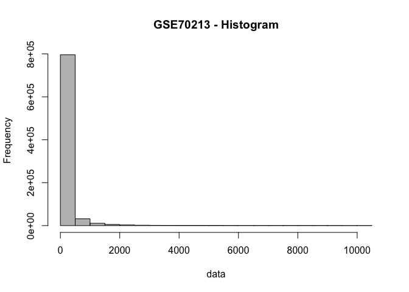<!-- -->

Since there are a lot of values \< 1000, we use a log<sub>2</sub> scale
to transform the
data:

``` r
hist(log2(data + 1), col = "gray", main = "GSE70213 log transformed - Histogram")
```

<!-- -->

Rescale the rows in our data object:

``` r
sprDat <- t(scale(t(data)))
str(sprDat, max.level = 0, give.attr = FALSE)
```

    ##  num [1:35557, 1:24] -0.2042 0.9693 -0.0693 -0.3329 -0.7671 ...

``` r
round(
  data.frame(
    avgBefore = rowMeans(head(data)),
    avgAfter = rowMeans(head(sprDat)),
    varBefore = apply(head(data), 1, var),
    varAfter = apply(head(sprDat), 1, var)
  ),
  2
)
```

    ##          avgBefore avgAfter varBefore varAfter
    ## 10338001   2109.42        0 110944.28        1
    ## 10338002     55.62        0     70.82        1
    ## 10338003    645.76        0  22386.92        1
    ## 10338004    280.43        0   7513.48        1
    ## 10338005      2.92        0      0.02        1
    ## 10338006      3.64        0      0.07        1

Now the data for each row (one probeset) has a mean of 0 and variance of
1.

## Sample Clustering

1.  Cluster the data using agglomerative hierarchical clustering.
      - partitions can be visualized using a **dendrogram** at various
        levels of granularity – no need to input the number of clusters
2.  Find various clustering solutions using partitional clustering
    methods, specifically K-means and partition around medoids (PAM).
      - partitions are independent of each other, and the number of
        clusters is given as an input

### Part I: Hierarchical Clustering Methods

#### Hierarchical Clustering for Mice Knockout Data

``` r
data_to_plot = sprDat
# compute pairwise distances
pr.dis <- dist(t(data_to_plot), method = "euclidean")

# create a new factor representing the interaction of tissue type and genotype
prDes$grp <- with(prDes, interaction(tissue, genotype))
summary(prDes$grp)
```

    ##    quadriceps.control        soleus.control quadriceps.nebulin KO 
    ##                     6                     6                     6 
    ##     soleus.nebulin KO 
    ##                     6

``` r
# compute hierarchical clustering using different linkage types
pr.hc.s <- hclust(pr.dis, method = "single")
pr.hc.c <- hclust(pr.dis, method = "complete")
pr.hc.a <- hclust(pr.dis, method = "average")
pr.hc.w <- hclust(pr.dis, method = "ward.D")

# plot them
op <- par(mar = c(0, 4, 4, 2), mfrow = c(2, 2))

plot(pr.hc.s, labels = FALSE, main = "Single", xlab = "")
plot(pr.hc.c, labels = FALSE, main = "Complete", xlab = "")
plot(pr.hc.a, labels = FALSE, main = "Average", xlab = "")
plot(pr.hc.w, labels = FALSE, main = "Ward", xlab = "")
```

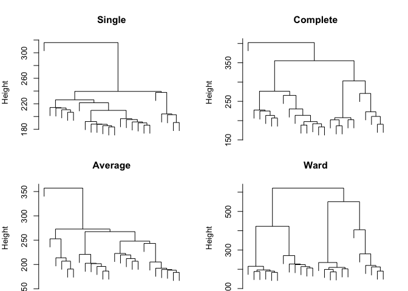<!-- -->

``` r
par(op)
```

<!-- > **Exercise:** Play with the options of the pheatmap function and compare the different heatmaps. Note that one can also use the original data data and set the option scale = "row". You will get the same heatmaps although the columns may be ordered differently (use cluster_cols = FALSE to suppress reordering). -->

``` r
# set pheatmap clustering parameters
clust_dist_col = "euclidean"  #‘'correlation'’ for Pearson correlation, ‘'euclidean'’, ‘'maximum'’, ‘'manhattan'’, ‘'canberra'’, ‘'binary'’ or ‘'minkowski'’
clust_method = "ward.D2"  #‘'ward.D'’, ‘'ward.D2'’,‘'single'’, ‘'complete'’, ‘'average'’ (= UPGMA), ‘'mcquitty'’ (= WPGMA), ‘'median'’ (= WPGMC) or ‘'centroid'’ (= UPGMC)
clust_scale = "none"  #'column', 'none', 'row'

## the annotation option uses the covariate object (prDes) we defined. It should
## have the same rownames, as the colnames in our data object (data_to_plot).

pheatmap(
  data_to_plot,
  cluster_rows = FALSE,
  scale = clust_scale,
  clustering_method = clust_method,
  clustering_distance_cols = clust_dist_col,
  show_colnames = T,
  show_rownames = FALSE,
  main = "Clustering heatmap for GSE70213",
  annotation = prDes[, c("tissue", "genotype",
                         "grp")]
)
```

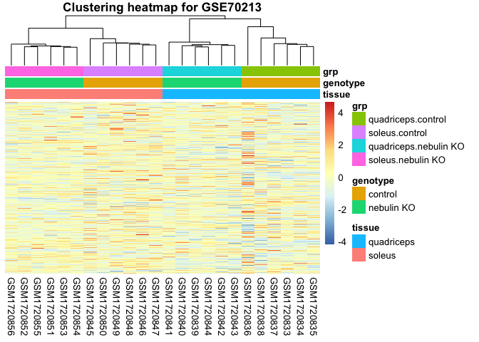<!-- -->

Change the colours of the different covariates:

``` r
## We can change the colours of the covariates
var1 = c("orange1", "darkred")
names(var1) = levels(prDes$tissue)
var2 = c("grey", "black")
names(var2) = levels(prDes$genotype)
var3 = c("pink1", "pink3", "lightblue1", "blue3")
names(var3) = levels(as.factor(prDes$grp))
covar_color = list(tissue = var1,
                   genotype = var2,
                   grp = var3)

my_heatmap_obj = pheatmap(
  data_to_plot,
  cluster_rows = FALSE,
  scale = clust_scale,
  clustering_method = clust_method,
  clustering_distance_cols = clust_dist_col,
  show_rownames = FALSE,
  main = "Clustering heatmap for GSE70213",
  annotation = prDes[,
                     c("tissue", "genotype", "grp")],
  annotation_colors = covar_color
)
```

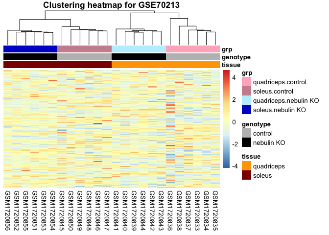<!-- -->

Get clusters from `pheatmap` object:

``` r
cluster_samples = cutree(my_heatmap_obj$tree_col, k = 10)
# cluster_genes = cutree(my_heatmap_obj$tree_row, k=100)
kable(cluster_samples)
```

|            |  x |
| ---------- | -: |
| GSM1720833 |  1 |
| GSM1720834 |  1 |
| GSM1720835 |  1 |
| GSM1720836 |  2 |
| GSM1720837 |  1 |
| GSM1720838 |  3 |
| GSM1720839 |  4 |
| GSM1720840 |  4 |
| GSM1720841 |  5 |
| GSM1720842 |  4 |
| GSM1720843 |  4 |
| GSM1720844 |  4 |
| GSM1720845 |  6 |
| GSM1720846 |  7 |
| GSM1720847 |  7 |
| GSM1720848 |  7 |
| GSM1720849 |  8 |
| GSM1720850 |  9 |
| GSM1720851 | 10 |
| GSM1720852 | 10 |
| GSM1720853 | 10 |
| GSM1720854 | 10 |
| GSM1720855 | 10 |
| GSM1720856 | 10 |

Do the same but using `hclust`:

``` r
# identify 10 clusters
op <- par(mar = c(1, 4, 4, 1))
plot(pr.hc.w, labels = prDes$grp, cex = 0.6, main = "Ward showing 10 clusters")
rect.hclust(pr.hc.w, k = 10)
```

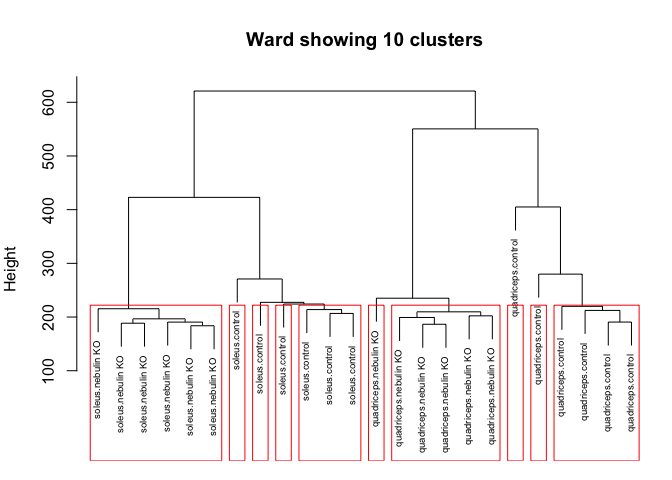<!-- -->

``` r
par(op)
```

Saving the heatmap:

``` r
# Save the heatmap to a PDF file
pdf("GSE70213_Heatmap.pdf")
pheatmap(data_to_plot, cluster_rows = F, scale = clust_scale, clustering_method = clust_method, 
    clustering_distance_cols = clust_dist_col, annotation = prDes[, c("tissue", "genotype", 
        "grp")], annotation_colors = covar_color)
dev.off()
```

    ## pdf 
    ##   3

### Part II: Parametric and Alternative Non-Parametric Clustering with PCA and t-SNE

#### Partitioning Methods for Mice Knockout Data

K-means clustering of samples using all genes:

``` r
# Objects in columns
set.seed(31)
k <- 5
pr.km <- kmeans(t(data_to_plot), centers = k, nstart = 50)

# We can look at the within sum of squares of each cluster
pr.km$withinss
```

    ## [1]      0.00 131484.25 107233.61 103083.34  95226.22

``` r
# We can look at the composition of each cluster
pr.kmTable <- data.frame(exptStage = prDes$grp, cluster = pr.km$cluster)
kable(pr.kmTable)
```

|            | exptStage             | cluster |
| ---------- | :-------------------- | ------: |
| GSM1720833 | quadriceps.control    |       4 |
| GSM1720834 | quadriceps.control    |       4 |
| GSM1720835 | quadriceps.control    |       4 |
| GSM1720836 | quadriceps.control    |       1 |
| GSM1720837 | quadriceps.control    |       4 |
| GSM1720838 | quadriceps.control    |       4 |
| GSM1720839 | quadriceps.nebulin KO |       3 |
| GSM1720840 | quadriceps.nebulin KO |       3 |
| GSM1720841 | quadriceps.nebulin KO |       3 |
| GSM1720842 | quadriceps.nebulin KO |       3 |
| GSM1720843 | quadriceps.nebulin KO |       3 |
| GSM1720844 | quadriceps.nebulin KO |       3 |
| GSM1720845 | soleus.control        |       2 |
| GSM1720846 | soleus.control        |       2 |
| GSM1720847 | soleus.control        |       2 |
| GSM1720848 | soleus.control        |       2 |
| GSM1720849 | soleus.control        |       2 |
| GSM1720850 | soleus.control        |       2 |
| GSM1720851 | soleus.nebulin KO     |       5 |
| GSM1720852 | soleus.nebulin KO     |       5 |
| GSM1720853 | soleus.nebulin KO     |       5 |
| GSM1720854 | soleus.nebulin KO     |       5 |
| GSM1720855 | soleus.nebulin KO     |       5 |
| GSM1720856 | soleus.nebulin KO     |       5 |

Using the PAM algorithmn, to identify a suitable k:

``` r
pr.pam <- pam(pr.dis, k = k)
pr.pamTable <- data.frame(exptStage = prDes$grp, cluster = pr.pam$clustering)
kable(pr.pamTable)
```

|            | exptStage             | cluster |
| ---------- | :-------------------- | ------: |
| GSM1720833 | quadriceps.control    |       1 |
| GSM1720834 | quadriceps.control    |       1 |
| GSM1720835 | quadriceps.control    |       1 |
| GSM1720836 | quadriceps.control    |       2 |
| GSM1720837 | quadriceps.control    |       1 |
| GSM1720838 | quadriceps.control    |       3 |
| GSM1720839 | quadriceps.nebulin KO |       3 |
| GSM1720840 | quadriceps.nebulin KO |       3 |
| GSM1720841 | quadriceps.nebulin KO |       3 |
| GSM1720842 | quadriceps.nebulin KO |       3 |
| GSM1720843 | quadriceps.nebulin KO |       3 |
| GSM1720844 | quadriceps.nebulin KO |       3 |
| GSM1720845 | soleus.control        |       4 |
| GSM1720846 | soleus.control        |       5 |
| GSM1720847 | soleus.control        |       5 |
| GSM1720848 | soleus.control        |       5 |
| GSM1720849 | soleus.control        |       5 |
| GSM1720850 | soleus.control        |       4 |
| GSM1720851 | soleus.nebulin KO     |       4 |
| GSM1720852 | soleus.nebulin KO     |       4 |
| GSM1720853 | soleus.nebulin KO     |       4 |
| GSM1720854 | soleus.nebulin KO     |       4 |
| GSM1720855 | soleus.nebulin KO     |       4 |
| GSM1720856 | soleus.nebulin KO     |       4 |

Making a silhouette plot:

``` r
op <- par(mar = c(5, 1, 4, 4))
plot(pr.pam, main = "Silhouette Plot for 5 clusters")
```

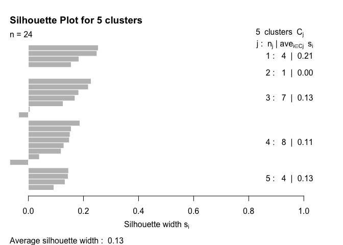<!-- -->

``` r
par(op)
```

\<\!–\> Take-home problem (1) Draw a plot with number of clusters in the
x-axis and the average silhouette widths in the y-axis. Use the
information obtained to determine if 5 was the best choice for the
number of clusters.

> Take-home problem (2) For a common choice of k, compare the clustering
> across different methods, e.g. hierarchical (pruned to specific k,
> obviously), k-means, PAM. You will re-discover the “label switching
> problem” for yourself. How does that manifest itself? How concordant
> are the clusterings for different methods? –\>

## Gene Clustering

### A Smaller Dataset

Using `limma`:

``` r
cutoff <- 1e-05
DesMat <- model.matrix(~grp, prDes)
dsFit <- lmFit(sprDat, DesMat)
dsEbFit <- eBayes(dsFit)
dsHits <- topTable(dsEbFit, coef = grep("grp", colnames(coef(dsEbFit))), p.value = cutoff, 
    n = Inf)
numBHhits <- nrow(dsHits)

topGenes <- rownames(dsHits)

# Scaled data of topGenes
topDat <- sprDat[topGenes, ]
```

### Agglomerative Hierarchical Clustering

Plot the heatmap using the `pheatmap`
function:

``` r
pheatmap(topDat, cluster_rows = TRUE, scale = "none", clustering_method = "average", 
    clustering_distance_cols = "euclidean", clustering_distance_rows = "euclidean", 
    annotation = prDes[, c("tissue", "genotype", "grp")], show_rownames = FALSE, 
    annotation_colors = covar_color)
```

<!-- -->

Plot the heatmap using the `plot` function after making the `hclust`
object:

``` r
geneC.dis <- dist(topDat, method = "euclidean")

geneC.hc.a <- hclust(geneC.dis, method = "average")

plot(geneC.hc.a, labels = FALSE, main = "Hierarchical with Average Linkage", xlab = "")
```

<!-- -->

### Partitioning Methods

Visualize a cluster using line plots:

``` r
set.seed(1234)
k <- 5
kmeans.genes <- kmeans(topDat, centers = k)

# choose which cluster we want
clusterNum <- 2

# Set up the axes without plotting; ylim set based on trial run.
plot(kmeans.genes$centers[clusterNum, ], ylim = c(0, 10), type = "n", xlab = "Samples", 
    ylab = "Relative expression")

# Plot the expression of all the genes in the selected cluster in grey.
matlines(y = t(topDat[kmeans.genes$cluster == clusterNum, ]), col = "grey")

# Add the cluster center. This is last so it isn't underneath the members
points(kmeans.genes$centers[clusterNum, ], type = "l")

# Optional: colored points to show which stage the samples are from.
points(kmeans.genes$centers[clusterNum, ], col = prDes$grp, pch = 20)
```

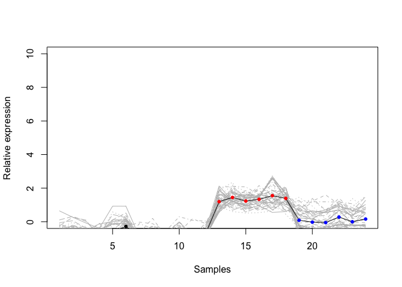<!-- -->

## Evaluating Clusters

### Choosing the Right k

Calculating the AIC for each choice of k:

``` r
set.seed(31)

k_max <- 10  # the max number of clusters to explore clustering with 
km_fit <- list()  # create empty list to store the kmeans object

for (i in 1:k_max) {
    k_cluster <- kmeans(t(sprDat), centers = i, nstart = 50)
    km_fit[[i]] <- k_cluster
}


# calculate AIC
km_AIC <- function(km_cluster) {
    m <- ncol(km_cluster$centers)
    n <- length(km_cluster$cluster)
    k <- nrow(km_cluster$centers)
    D <- km_cluster$tot.withinss
    return(D + 2 * m * k)
}
```

Plot the AIC vs the number of clusters:

``` r
aic <- sapply(km_fit, km_AIC)
plot(seq(1, k_max), aic, xlab = "Number of clusters", ylab = "AIC", pch = 20, cex = 2, 
    main = "Clustering Samples")
```

<!-- -->

Do the same for BIC:

``` r
# calculate BIC
km_BIC <- function(km_cluster) {
    m <- ncol(km_cluster$centers)
    n <- length(km_cluster$cluster)
    k <- nrow(km_cluster$centers)
    D <- km_cluster$tot.withinss
    return(D + log(n) * m * k)
}

bic <- sapply(km_fit, km_BIC)
plot(seq(1, k_max), bic, xlab = "Number of clusters", ylab = "BIC", pch = 20, cex = 2, 
    main = "Clustering Samples")
```

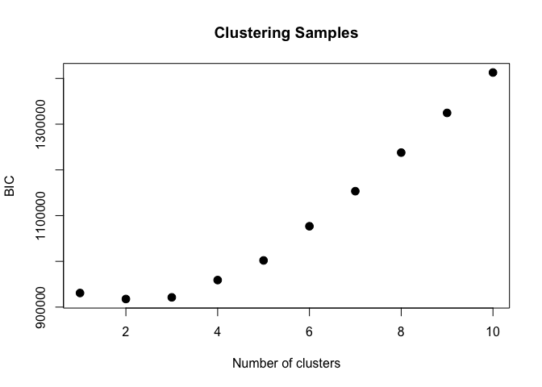<!-- -->

### Statistical Methods

Identify the most stable clustering arising from hierarchical
clustering:

``` r
pvc <- pvclust(topDat, nboot = 100)
```

    ## Bootstrap (r = 0.5)... Done.
    ## Bootstrap (r = 0.6)... Done.
    ## Bootstrap (r = 0.7)... Done.
    ## Bootstrap (r = 0.8)... Done.
    ## Bootstrap (r = 0.9)... Done.
    ## Bootstrap (r = 1.0)... Done.
    ## Bootstrap (r = 1.1)... Done.
    ## Bootstrap (r = 1.2)... Done.
    ## Bootstrap (r = 1.3)... Done.
    ## Bootstrap (r = 1.4)... Done.

``` r
plot(pvc, labels = prDes$grp, cex = 0.6)
pvrect(pvc, alpha = 0.95)
```

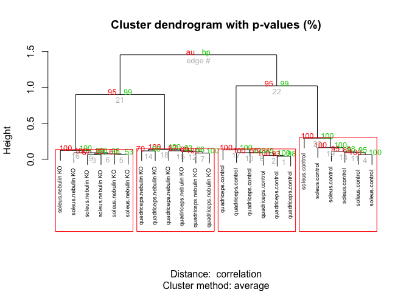<!-- -->

## Feature Reduction

### PCA Plots

Plot a PCA plot using `prcomp()` (or `svd()`):

``` r
pcs <- prcomp(sprDat, center = FALSE, scale = FALSE)

# scree plot
plot(pcs)
```

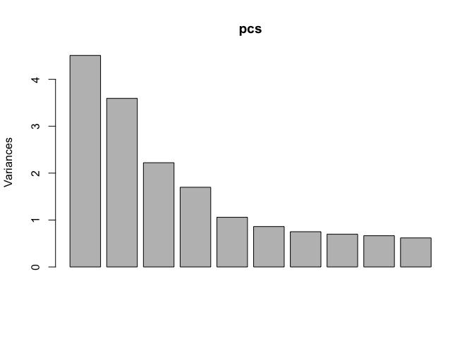<!-- -->

``` r
# append the rotations for the first 10 PCs to the phenodata
prinComp <- cbind(prDes, pcs$rotation[rownames(prDes), 1:10])

# scatter plot showing us how the first few PCs relate to covariates
plot(prinComp[, c("genotype", "tissue", "PC1", "PC2", "PC3")], pch = 19, cex = 0.8)
```

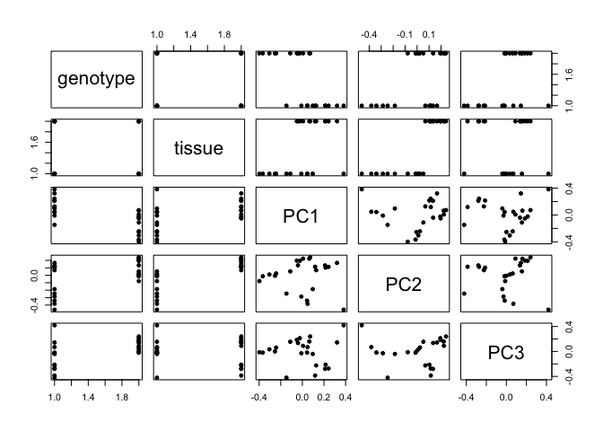<!-- -->

Spread of the samples, explained by their 2 principal components:

``` r
plot(prinComp[, c("PC1", "PC2")], pch = 21, cex = 1.5)
```

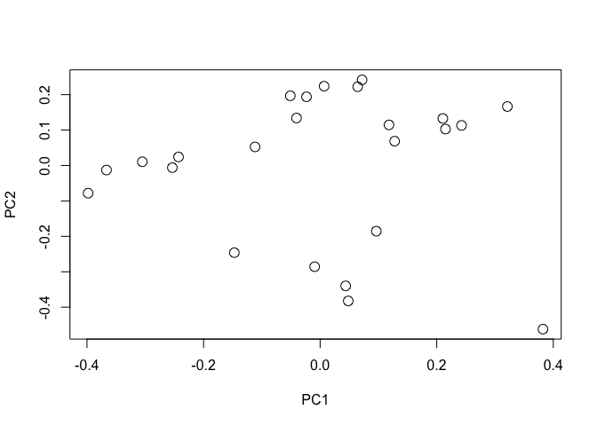<!-- -->

Localization of the covariate `tissue` in the different
clusters:

``` r
plot(prinComp[, c("PC1", "PC2")], bg = prDes$tissue, pch = 21, cex = 1.5)
legend(list(x = 0.2, y = 0.3), as.character(levels(prDes$tissue)), pch = 21, pt.bg = c(1, 
    2, 3, 4, 5))
```

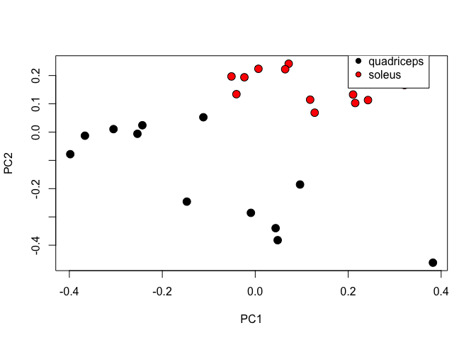<!-- -->

Localization of the covariate `genotype` in the different
clusters:

``` r
plot(prinComp[, c("PC1", "PC2")], bg = prDes$genotype, pch = 21, cex = 1.5)
legend(list(x = 0.2, y = 0.3), as.character(levels(prDes$genotype)), pch = 21, pt.bg = c(1, 
    2, 3, 4, 5))
```

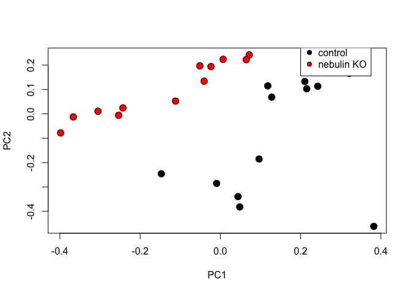<!-- -->

Assess how much of the total variance is captured by each principal
component:

``` r
# Get the subset of PCs that capture the most variance in your predictors
summary(pcs)
```

    ## Importance of components:
    ##                           PC1    PC2     PC3     PC4     PC5     PC6     PC7
    ## Standard deviation     2.1235 1.8957 1.49067 1.30336 1.02878 0.92795 0.86674
    ## Proportion of Variance 0.1961 0.1562 0.09661 0.07386 0.04602 0.03744 0.03266
    ## Cumulative Proportion  0.1961 0.3523 0.44890 0.52276 0.56877 0.60621 0.63887
    ##                            PC8     PC9    PC10    PC11    PC12   PC13    PC14
    ## Standard deviation     0.83534 0.81621 0.78678 0.77243 0.76143 0.7477 0.73139
    ## Proportion of Variance 0.03034 0.02896 0.02691 0.02594 0.02521 0.0243 0.02326
    ## Cumulative Proportion  0.66921 0.69817 0.72509 0.75103 0.77623 0.8005 0.82379
    ##                           PC15    PC16    PC17    PC18    PC19    PC20    PC21
    ## Standard deviation     0.72127 0.70872 0.69406 0.67519 0.67423 0.65740 0.64933
    ## Proportion of Variance 0.02262 0.02184 0.02094 0.01982 0.01976 0.01879 0.01833
    ## Cumulative Proportion  0.84641 0.86825 0.88919 0.90901 0.92878 0.94757 0.96590
    ##                           PC22    PC23      PC24
    ## Standard deviation     0.62812 0.62433 6.079e-15
    ## Proportion of Variance 0.01715 0.01695 0.000e+00
    ## Cumulative Proportion  0.98305 1.00000 1.000e+00

Select the rotated data from the first `n` components:

``` r
pcs_2dim = prcomp(sprDat, center = FALSE, scale = FALSE, tol = 0.8)
```

### t-SNE Plots

``` r
library(Rtsne)
colors = rainbow(length(unique(prDes$grp)))
names(colors) = unique(prDes$grp)
tsne <- Rtsne(unique(t(sprDat)), dims = 2, perplexity = 0.1, verbose = TRUE, max_iter = 100)
```

    ## Performing PCA
    ## Read the 24 x 24 data matrix successfully!
    ## OpenMP is working. 1 threads.
    ## Using no_dims = 2, perplexity = 0.100000, and theta = 0.500000
    ## Computing input similarities...
    ## Perplexity should be lower than K!
    ## Building tree...
    ## Done in 0.00 seconds (sparsity = 0.000000)!
    ## Learning embedding...
    ## Iteration 50: error is 0.000000 (50 iterations in 0.00 seconds)
    ## Iteration 100: error is 0.000000 (50 iterations in 0.00 seconds)
    ## Fitting performed in 0.00 seconds.

``` r
plot(tsne$Y, main = "tsne")
text(tsne$Y, labels = prDes$grp, col = colors[prDes$grp])
```

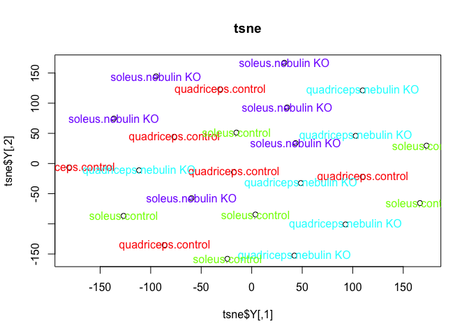<!-- -->

``` r
tsne_p1 <- Rtsne(unique(t(sprDat)), dims = 2, perplexity = 1, verbose = TRUE, max_iter = 100)
```

    ## Performing PCA
    ## Read the 24 x 24 data matrix successfully!
    ## OpenMP is working. 1 threads.
    ## Using no_dims = 2, perplexity = 1.000000, and theta = 0.500000
    ## Computing input similarities...
    ## Building tree...
    ## Done in 0.00 seconds (sparsity = 0.163194)!
    ## Learning embedding...
    ## Iteration 50: error is 71.205265 (50 iterations in 0.00 seconds)
    ## Iteration 100: error is 60.195503 (50 iterations in 0.00 seconds)
    ## Fitting performed in 0.00 seconds.

``` r
plot(tsne_p1$Y, main = "tsne")
text(tsne_p1$Y, labels = prDes$grp, col = colors[prDes$grp])
```

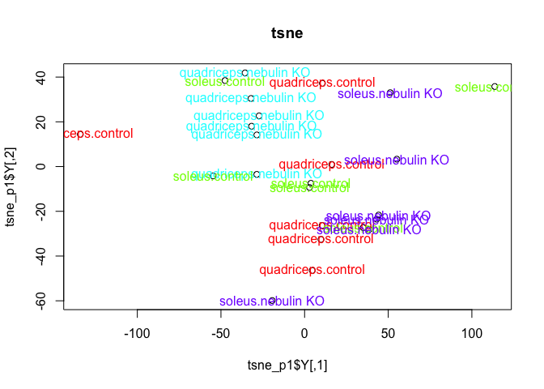<!-- -->

## Deliverables

### Heatmap

> Regenerate the pheatmap clustering plot for the top genes, selected
> from limma, using clustering distance: correlation, and clustering
> method: mcquitty.

To construct the heatmap using the top genes, the `topDat` tibble from
the `limma` output was used. The parameter `clustering_method` was
changed to `mcquitty` and the `clustering_distance_cols` parameter was
changed to `correlation`.

``` r
pheatmap(topDat, 
         cluster_rows = FALSE, 
         scale = "none", 
         clustering_method = "mcquitty", 
         clustering_distance_cols = "correlation",
         show_colnames = T, 
         show_rownames = FALSE, 
         main = "Clustering heatmap for GSE70213", 
         annotation = prDes[, c("tissue", "genotype", 
      "grp")])
```

<!-- -->

### Dendrogram

> Regenerate the dendrogram on the samples of this heatmap using the
> `hclust` and `dist` functions.

To construct the dendrogram using `clustering distance: correlation` and
`clustering method: mcquitty`, a distance matrix was created using
`as.dist()`, with the input as `1-cor(data)`, and then divided by 2 to
scale it in order to see the sample
labels.

``` r
# heat map above using clustering distance: correlation; clustering method: mcquitty

pr.dis2 <- as.dist((1-cor(topDat))/2)
pr.hc2 <- hclust(pr.dis2, method = "mcquitty")

plot(pr.hc2, main="mcquitty", xlab="")
```

<!-- -->

``` r
# heat map above using clustering distance: correlation; clustering method: mcquitty

pr.dis <- as.dist(1-cor(topDat))
pr.hc <- hclust(pr.dis, method = "mcquitty")

plot(pr.hc, labels = FALSE, main = "mcquitty", xlab = "")
```

### PCA

> Plot the data for this analyses along PCs 1 and 2 using `ggplot`
> instead base plotting. Color the points by tissue.

The plot shows that PC2 is tissue, as the points corresponding to the
quadriceps cluster towards the top, and the soleus tissue clusters
toward the bottom.

``` r
ggplot(prinComp, aes(x = PC1, y = PC2)) +
  geom_point(aes(colour = tissue)) +
  ggtitle("PCA")
```

<!-- -->
