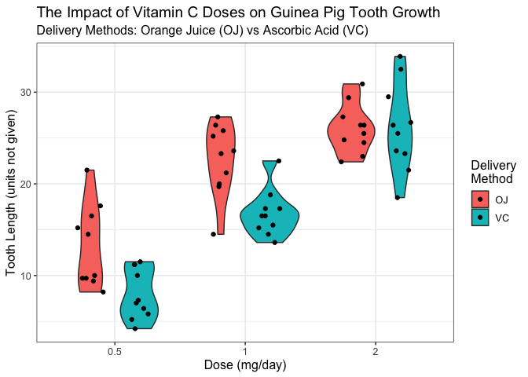

Warm Up Assignment
================
Diana Lin
09/01/2020

## README

The README for this *repository* can be found [here](../README.md).

## Exploring the `Titanic` Dataset

Before we start, let’s load some packages that might be helpful:

``` r
library(tidyverse) # for dplyr and ggplot
```

First, let’s convert the `Titanic` dataset into a dataframe, and then
take a brief glimpse into it.

``` r
titanic_df <- data.frame(Titanic) # convert the dataset into a dataframe
summary(titanic_df) # glimpse at summary of the dataset
```

    ##   Class       Sex        Age     Survived      Freq       
    ##  1st :8   Male  :16   Child:16   No :16   Min.   :  0.00  
    ##  2nd :8   Female:16   Adult:16   Yes:16   1st Qu.:  0.75  
    ##  3rd :8                                   Median : 13.50  
    ##  Crew:8                                   Mean   : 68.78  
    ##                                           3rd Qu.: 77.00  
    ##                                           Max.   :670.00

### Passenger Breakdown

#### Children vs. Adults

To find out how many children and adults were on the Titanic, we will
use the `dplyr` function `filter()` and `select()`, and the `baseR`
function `sum()`:

``` r
# Count number of adults
num_adults <- titanic_df %>% 
  # Input is the titanic dataframe
  filter(Age == "Adult") %>% # filter for rows where the passenger is an Adult
  select(Freq) %>% # Select the frequency column
  sum()

# Count number of children
num_children <- titanic_df %>%
  filter(Age == "Child") %>% # filter for rows where the passenger is a Child
  select(Freq) %>%
  sum() 
```

**Conclusion**: There were 109 children and 2092 adults onboard the
Titanic.

#### Male vs. Female Adults

Next, we want to find out if there were more female adult or male adult
passengers. To do this, let’s do the same thing as above but with the
`Sex` and `Age` column.

``` r
# Count number of females
num_females <- titanic_df %>%
  filter(Sex == "Female", Age == "Adult") %>%
  select(Freq) %>%
  sum()

# Count number of males
num_males <- titanic_df %>%
  filter(Sex == "Male", Age == "Adult") %>%
  select(Freq) %>%
  sum()

# case statement for the inline R code conclusion below
sex <- case_when(
  num_females > num_males ~ "more female adult passengers",
  num_females < num_males ~ "more male adult passengers",
  num_females == num_males ~ "the same number of male and female adult passengers"
)
```

There were 425 female adults and 1667 male adults onboard the Titanic.

**Conclusion**: There were more male adult passengers on the Titanic.

### Survival Rates

#### Adult vs. Child

To find out whether the children had better survival rate than adults,
we will need to check the columns `Age` and `Survived`, filtering and
counting. Then we will take that number and divide it by the number in
each age group that boarded the Titanic.

``` r
# Count the number of children survived
num_children_survived <- titanic_df %>%
  filter(Age == "Child", Survived == "Yes") %>%
  select(Freq) %>%
  sum()

# Count the numer of adults survived
num_adults_survived <- titanic_df %>%
  filter(Age == "Adult", Survived == "Yes") %>%
  select(Freq) %>%
  sum()

# Calculate the survival rate for children
children_survival <- round(num_children_survived / num_children*100, digits = 1)

# Calculate the survival rate for adults
adult_survival <- round(num_adults_survived / num_adults*100, digits = 1)

# case statement for inline R code conclusion
better_survival <- case_when(
  children_survival > adult_survival ~ "children had a better survival rate",
  adult_survival > children_survival ~ "adults had a better survival rate",
  adult_survival == children_survival ~ "adults and children had the same survival rate"
)
```

57 out of 109 child passengers survived.

654 out of 2092 adult passengers survived.

| Age   | Survival Rate |
| ----- | ------------- |
| Child | 52.3%         |
| Adult | 31.3%         |

**Conclusion**: The children had a better survival rate on the Titanic.

#### First vs. Second vs. Third vs. Crew Class

Next, we look at whether the class of the passengers impacted the
survival rate. To do this, we repeat the above, but by looking at
`Class` and `Survived`.

##### First Class

Let’s look at first class:

``` r
# Count number of first class passengers that boarded the Titanic
num_first <- titanic_df %>% 
  filter(Class == "1st") %>%
  select(Freq) %>%
  sum()

# Count number of survived first class passengers
num_first_survived <- titanic_df %>% 
  filter(Class == "1st", Survived == "Yes") %>%
  select(Freq) %>%
  sum()

# Calculate the survival rate
first_survival <- num_first_survived / num_first

percent_first <- round(first_survival*100,digits = 1)
```

203 out of 325 passengers in first class survived.

First class had a survival rate of 62.5%.

##### Second Class

Next, let’s look at second class:

``` r
# Count number of second class passengers that boarded the Titanic
num_second <- titanic_df %>% 
  filter(Class == "2nd") %>%
  select(Freq) %>%
  sum()

# Count number of survived second class passengers
num_second_survived <- titanic_df %>% 
  filter(Class == "2nd", Survived == "Yes") %>%
  select(Freq) %>%
  sum()

# Calculate the survival rate
second_survival <- num_second_survived / num_second
percent_second <- round(second_survival*100, digits=1)
```

118 out of 285 passengers in second class survived.

Second class had a survival rate of 41.4%.

##### Third Class

Now, let’s look at third class:

``` r
# Count number of third class passengers that boarded the Titanic
num_third <- titanic_df %>% 
  filter(Class == "3rd") %>%
  select(Freq) %>%
  sum()

# Count number of survived third class passengers
num_third_survived <- titanic_df %>% 
  filter(Class == "3rd", Survived == "Yes") %>%
  select(Freq) %>%
  sum()

# Calculate the survival rate
third_survival <- num_third_survived / num_third
percent_third <- round(third_survival*100, digits=1)
```

178 out of 706 passengers in third class survived.

Third class had a survival rate of 25.2%.

##### Crew

Lastly, let’s look at the crew:

``` r
# Count number of crew  that boarded the Titanic
num_crew <- titanic_df %>% 
  filter(Class == "Crew") %>%
  select(Freq) %>%
  sum()

# Count number of survived crew
num_crew_survived <- titanic_df %>% 
  filter(Class == "Crew", Survived == "Yes") %>%
  select(Freq) %>%
  sum()

# Calculate the survival rate
crew_survival <- num_crew_survived / num_crew
percent_crew <- round(crew_survival*100, digits=1)
```

212 out of 885 crew members survived.

Crew members had a survival rate of 24%.

##### Summary

Let’s summarize our survival rates so far:

| Class  | Survival Rate |
| ------ | ------------- |
| First  | 62.5%         |
| Second | 41.4%         |
| Third  | 25.2%         |
| Crew   | 24%           |

Now to computationally compare these survival rates and return the class
with the best survival rate:

``` r
# put all survival rates into a vector
class_survival <- c(first_survival, second_survival, third_survival, crew_survival)

# have a corresponding name for each survival rate
class_survival_name <- c("first", "second", "third", "crew")

# find the highest value in the vector, best survival rate value
best_survival <- max(class_survival)

# find the corresponding indices of the vector that correspond to the max value and then get the name corresponding
best_survival_class <-  class_survival_name[which(class_survival %in% best_survival)]

# if all are the same survival rate, have a different statement/conclusion
best_survival_class_final <- if_else(
  var(class_survival) == 0, 
  "four classes had the same survival rate",
  paste(paste(best_survival_class, collapse = ', '),
        ifelse(
          length(best_survival_class) > 1,
          "classes had the best survival rate" ,
          "class had the best survival rate")))
```

**Conclusion**: The first class had the best survival rate on the
Titanic.

## Visualizing `ToothGrowth`

### Data

First, let’s read in the
file:

``` r
toothgrowth <- read.table("https://raw.githubusercontent.com/STAT540-UBC/STAT540-UBC.github.io/master/homework/practice_assignment/guinea_pigs_tooth_growth.txt", header = TRUE)
```

### Summary

Let’s take a glimpse at the summary:

``` r
summary(toothgrowth)
```

    ##       len        supp         dose      
    ##  Min.   : 4.20   OJ:30   Min.   :0.500  
    ##  1st Qu.:13.07   VC:30   1st Qu.:0.500  
    ##  Median :19.25           Median :1.000  
    ##  Mean   :18.81           Mean   :1.167  
    ##  3rd Qu.:25.27           3rd Qu.:2.000  
    ##  Max.   :33.90           Max.   :2.000

### Plot

Let’s plot a mix of a scatter plot and a violin plot:

``` r
toothgrowth %>%
  ggplot(aes(x=factor(dose), y=len, fill=supp)) +
  geom_violin(position = position_dodge(width = 0.75)) + # use width = 0.75 since the default for position_jitterdodge() below default width is 0.75, factor since dose is a 'category'
  geom_point(position = position_jitterdodge()) + # use jitter to scatter the plots so that they're not all in one line, easier to distinguish points that would normally overalp
  labs(title = "The Impact of Vitamin C Doses on Guinea Pig Tooth Growth", 
       subtitle = "Delivery Methods: Orange Juice (OJ) vs Ascorbic Acid (VC)",
       x = "Dose (mg/day)",
       y = "Tooth Length (units not given)",
       fill = "Delivery\nMethod"
  ) +
  theme_bw() +
  theme(text = element_text(size=12))
```

<!-- -->

### Observations

What does this plot show us?

1.  Tooth length increases as the dose increases.
2.  For the doses of 0.5 mg/day and 1.0 mg/day, orange juice seems to be
    the more effective delivery method of Vitamin C, promoting more
    tooth growth (increase in tooth length) than ascorbic acid.
3.  For the dose of 2.0 mg/day, neither orange juice nor ascorbic acid
    seems to be more effective than the other.

### Plot Rationale

I chose this combination of a violin plot and a scatter plot for 2
reasons:

1.  **Violin plot**: to see the density/distribution of each data point.
2.  **Scatter plot**: there aren’t enough data points in this dataset
    for a violin plot alone to be very informative– since there are only
    a few points, being able to see each individual point is better.
